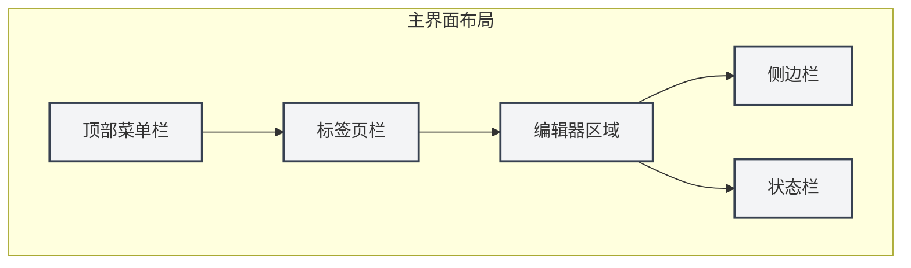
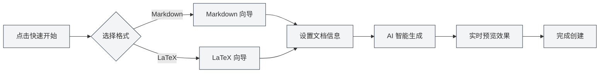

# 快速開始指南

## 概述

歡迎使用 MetaDoc！這是一款為知識工作者設計的智能文件處理工具。無論您是在撰寫技術部落格、整理學習筆記，還是準備學術論文，MetaDoc 都能為您提供專業而優雅的編輯體驗。

MetaDoc 深度整合了人工智慧能力，支援 Markdown 和 LaTeX 兩種主流文件格式。它不僅僅是一個文字編輯器，更是您的智能寫作助手——內建的 AI 對話、自動補全、智能校對等功能，讓文件創作變得更加高效和愉悅。

## 首次使用

### 啟動應用

啟動 MetaDoc 後，您首先看到的是主頁。這是一個精心設計的起點，讓您可以快速開始工作：

- **快速開始**：智能精靈會引導您選擇文件格式並建立新文件
- **新增文件**：直接建立空白文件，選擇您需要的格式
- **開啟檔案**：瀏覽並開啟已有的文件
- **使用者手冊**：隨時查閱詳細的使用指南

### 介面介紹

MetaDoc 的介面設計遵循現代編輯器的佈局理念，清晰而直觀：

1. **頂端選單列**

   位於視窗最上方，彙集了檔案、編輯、檢視等核心功能。無論您需要新增文件、尋找取代文字，還是切換檢視模式，都可以在這裡找到入口。選單列支援自訂，您可以根據使用習慣調整選單項的顯示與排序。

2. **標籤頁列**

   位於選單列下方，顯示目前開啟的所有文件。每個文件對應一個標籤頁，點擊即可切換。標籤頁支援拖曳排序，也可以固定常用文件，避免誤關閉。當標籤頁較多時，還可以跨視窗組織文件。

3. **編輯器區域**

   這是您的主要工作區。MetaDoc 針對不同類型的文件提供了專門的編輯環境：

   - **Markdown 編輯器**：所見即所得的編輯體驗，支援即時預覽、數學公式、圖表等豐富功能
   - **LaTeX 編輯器**：專業的學術寫作環境，支援程式碼醒目提示、智能提示、編譯預覽等功能

4. **側邊欄**

   位於編輯器左側，是您的文件導覽中心。您可以在這裡：

   - 切換編輯器、大綱、Agent 等不同檢視
   - 查看文件結構大綱
   - 管理知識庫和引用素材

5. **狀態列**

   位於視窗底部，即時顯示目前文件的狀態資訊，包括字數統計、儲存狀態、語言設定等，讓您對工作進度一目了然。

下方為對應的真實介面控制項展示，便於您對照操作：

**頂端選單列**

位於視窗最上方，包含檔案、編輯、檢視等主選單，提供應用級操作入口。您可以透過選單列執行新增、開啟、儲存文件，以及存取各種編輯和檢視功能。

<MenuItemsDemo mode="demo" :items='[{"id": "file", "items": ["new", "open", "save"]}, {"id": "edit", "items": ["undo", "redo", "find"]}, {"id": "view", "items": ["editor", "outline"]}]' />

**標籤頁列**

位於選單列下方，顯示目前開啟的所有文件標籤。您可以透過點擊標籤切換文件，拖曳標籤調整順序，或右鍵點擊標籤進行更多操作（如關閉、固定、移動到新視窗等）。

<MainTabs mode="demo" />

**側邊欄**

位於編輯器左側，提供多種輔助功能面板的入口。您可以透過側邊欄在編輯器檢視、大綱檢視、Agent檢視等之間快速切換，提高文件編輯效率。

<ViewMenuItemsDemo mode="demo" :items='["editor", "outline", "home"]' />

## 快速建立文件

### 方式一：使用快速開始精靈

MetaDoc 的快速開始精靈是一個貼心的設計。它不只是簡單地建立空白文件，而是像一位經驗豐富的助手，引導您完成文件建立的每一個步驟：

1. 在主頁點擊"快速開始"按鈕
2. 根據您的需求選擇文件格式：
   - **Markdown**：如果您要撰寫部落格、技術文件、會議記錄或任何日常文字內容，這是最輕便的選擇。Markdown 的語法簡單直觀，同時又能滿足豐富的排版需求。
   - **LaTeX**：如果您正在準備學術論文、學位論文或需要精確排版的科技文件，LaTeX 是學術界公認的標準。MetaDoc 讓複雜的 LaTeX 編譯變得簡單易懂。
3. 精靈會根據您的選擇，提供相應的範本和 AI 輔助功能

#### 格式選擇介面

精靈的第一步是選擇文件格式。MetaDoc 會根據您的使用場景，智能推薦合適的選項：

#### Markdown 快速開始

選擇 Markdown 後，精靈會提供：

- **智能標題建議**：AI 會根據您的初步輸入，建議合適的文件標題
- **結構化大綱**：自動產生文件框架，幫助您組織思路
- **即時預覽**：邊寫邊看，即時了解文件的最終呈現效果

#### LaTeX 快速開始

選擇 LaTeX 後，精靈會提供：

- **專業範本**：針對不同學術場景最佳化的範本（論文、報告、簡報等）
- **結構指導**：自動產生標準的 LaTeX 文件結構
- **智能補全**：AI 輔助產生 LaTeX 程式碼，降低學習門檻

#### 精靈的核心價值

快速開始精靈的精髓在於**降低門檻，提升效率**：

- **對新手友善**：不需要記憶複雜的語法，精靈會引導您一步步完成
- **對專家高效**：AI 輔助功能可以快速產生文件框架，節省重複勞動
- **上下文感知**：如果您已經有一些想法，可以直接告訴 AI，它會幫您擴展成完整的文件結構

#### 精靈工作流程

### 方式二：直接新增文件

如果您已經熟悉 MetaDoc，可以直接建立空白文件開始工作：

1. 點擊主頁的"新增文件"按鈕，或按快速鍵 `Ctrl+N`
2. 選擇文件格式（Markdown / LaTeX / 純文字）
3. 文件會立即在編輯器中開啟，您可以開始創作

這種方式適合有經驗的使用者，或是有明確寫作計劃的場景。

### 方式三：開啟現有檔案

繼續您之前的工作也很簡單：

1. 點擊主頁的"開啟檔案"按鈕，或按 `Ctrl+O`
2. 在檔案瀏覽器中找到您的文件
3. 選中的檔案會在新標籤頁中開啟，您可以無縫繼續編輯

MetaDoc 支援自動記憶您最近開啟的文件，方便您快速回到工作狀態。

## 基本操作

### 編輯文件

MetaDoc 的編輯體驗經過精心設計，讓您的注意力集中在內容本身：

- **流暢輸入**：無論是快速記錄靈感還是細緻打磨文字，編輯器都能跟得上您的思路
- **智能格式化**：Markdown 編輯器支援所見即所得，LaTeX 編輯器提供語法醒目提示和智能提示
- **豐富元素**：輕鬆插入圖片、表格、程式碼區塊、數學公式等元素，讓文件更加生動專業
- **即時預覽**：Markdown 文件可以邊寫邊看，即時了解最終效果

### 儲存文件

MetaDoc 提供多種儲存方式，確保您的工作不會遺失：

- **即時儲存**：`Ctrl+S` 快速儲存目前文件，這是最常用的操作
- **另存為新文件**：`Ctrl+Shift+S` 當您需要將目前文件另存為副本時使用
- **批次儲存**：`Ctrl+K S` 一次性儲存所有開啟的文件，適合整理工作收尾

此外，您還可以在設定中啟用自動儲存功能，讓 MetaDoc 定期自動儲存您的文件。

### 切換檢視

MetaDoc 提供多種檢視模式，滿足不同工作階段的需求：

- **編輯器檢視**：文件編輯的主要工作區，提供完整的編輯功能
- **大綱檢視**：以樹狀結構展示文件標題層級，適合快速導覽和結構調整
- **PDF 預覽**：LaTeX 文件編譯後的預覽，方便檢查最終排版效果

透過側邊欄或快速鍵，您可以快速在不同檢視間切換。

## 取得說明

MetaDoc 內建了詳細的使用者手冊，隨時為您解答疑問：

1. 按 `F1` 鍵或點擊主頁的"使用者手冊"按鈕
2. 手冊按主題分類，從基礎操作到進階功能一應俱全
3. 使用搜尋功能可以快速定位到您需要的內容

手冊涵蓋的內容包括：

- 編輯器的詳細使用指南
- 檔案和專案管理技巧
- AI 功能的深度教學
- Agent 框架的工作原理
- 個人化設定選項

## 探索更多

完成快速開始只是第一步。MetaDoc 還有許多強大功能等待您去探索：

1. **掌握編輯技巧**：了解[[core.editor-basics|編輯器基礎操作]]，提升寫作效率
2. **精通檔案管理**：學習[[core.file-operations|檔案操作]]的最佳實踐
3. **深入編輯器功能**：
   - Markdown 使用者：查看[[markdown.editor|Markdown 編輯器使用指南]]
   - LaTeX 使用者：查看[[latex.editor|LaTeX 編輯器使用指南]]
4. **體驗 AI 能力**：嘗試[[ai.chat|AI 對話]]和[[ai.completion|AI 自動補全]]功能

MetaDoc 的設計理念是**讓技術隱形，讓創作自由**。希望這款工具能成為您知識工作的得力助手。

## 相關文件

- [[core.file-operations|檔案操作]]
- [[core.editor-basics|編輯器基礎操作]]
- [[markdown.editor|Markdown 編輯器使用指南]]
- [[latex.editor|LaTeX 編輯器使用指南]]
- [[settings.basic|基礎設定]]
