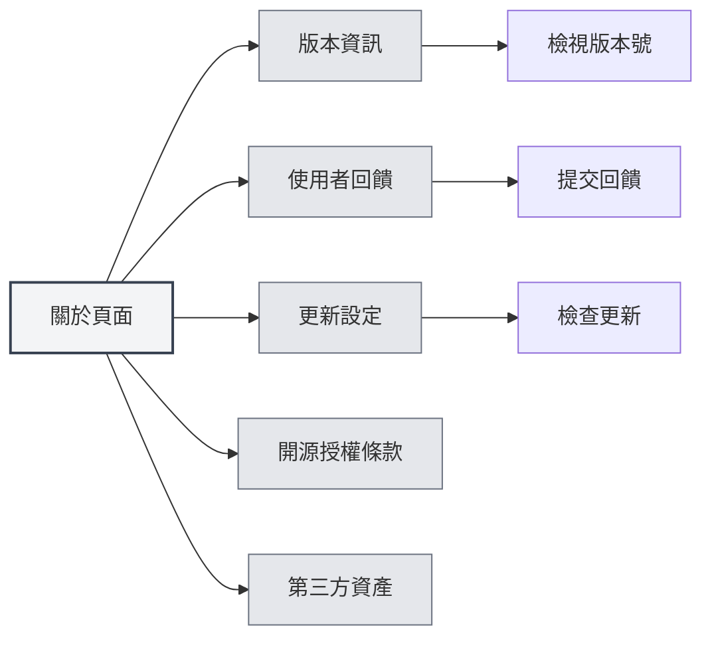
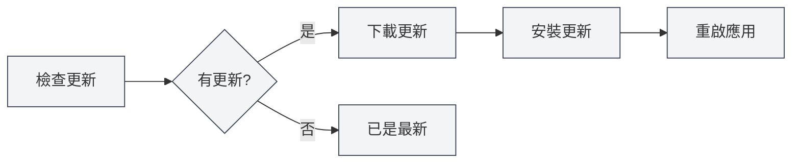

# 關於資訊

## 概述

關於頁面提供了 MetaDoc 的版本資訊、更新設定、開源授權條款和第三方資產資訊。您可以透過此頁面瞭解應用資訊、檢查更新、提交回饋等。

## 版本資訊

### 檢視版本

在關於頁面，您可以檢視以下資訊：

- **應用名稱**：MetaDoc
- **版本號**：目前安裝的版本號
- **發佈日期**：目前版本的發佈日期
- **建置環境**：開發版本或發佈版本

您可以透過頂端選單列存取關於頁面：

<MenuItemsDemo mode="demo" :items='[{"id": "settings", "items": ["about"]}]' />



### 版本格式

版本號使用語意化版本格式：

```
主版本號.次版本號.修訂號
```

例如：`0.12.1`

### 建置環境

- **開發版本**：開發環境建置的版本，可能包含除錯資訊
- **發佈版本**：正式發佈的版本，經過測試和優化

<SettingAboutSection mode="demo" />

## 使用者回饋

### 提交回饋

您可以透過以下方式提交回饋：

1.  在關於頁面，點擊「使用者回饋」按鈕
2.  在回饋頁面填寫回饋內容
3.  提交回饋

### 回饋內容

回饋時可以包含以下資訊：

- **問題描述**：詳細描述遇到的問題
- **重現步驟**：說明如何重現問題
- **期望行為**：說明期望的行為
- **實際行為**：說明實際發生的行為
- **環境資訊**：作業系統、版本號等

### 回饋建議

- **詳細描述**：盡可能詳細地描述問題
- **提供截圖**：如有必要，提供截圖或錄影
- **版本資訊**：包含版本號和建置環境資訊
- **重現步驟**：提供清晰的重現步驟

<UserFeedbackView mode="demo" />

## 官方 QQ 群

### 加入 QQ 群

MetaDoc 官方 QQ 群：**1079841705**

加入 QQ 群可以：

-   獲取最新資訊和更新通知
-   與其他使用者交流使用經驗
-   獲得技術支援
-   參與功能討論

### 群內資源

QQ 群提供以下資源：

- **使用教學**：群檔案中的使用教學
- **問題解答**：群內成員互相幫助
- **更新通知**：第一時間獲取更新資訊
- **功能建議**：參與功能討論和建議

## 更新設定

### 自動檢查更新

啟用「自動檢查更新」後，MetaDoc 會在啟動時自動檢查是否有新版本：

- **啟用**：啟動時自動檢查更新
- **停用**：不自動檢查更新

### 更新管道

可以選擇更新管道：

- **正式版**：使用正式發佈的版本（推薦）
- **開發版**：使用開發版本（可能不穩定）

<MainTabs mode="demo" />

### 手動檢查更新

您可以隨時手動檢查更新：

1.  在關於頁面的「更新設定」標籤頁
2.  點擊「檢查更新」按鈕
3.  等待檢查完成

### 更新狀態

檢查更新後會顯示以下狀態：

- **有更新可用**：顯示新版本資訊，可以下載更新
- **已是最新版本**：目前版本是最新的
- **檢查失敗**：顯示錯誤資訊

### 下載和安裝更新

如果有更新可用：

1.  **下載更新**：點擊「下載更新」按鈕
2.  **等待下載**：檢視下載進度
3.  **安裝更新**：下載完成後，點擊「安裝並重新啟動」按鈕
4.  **自動重啟**：應用會自動重新啟動並安裝更新



<QuickStartPanel mode="demo" />

## 開源授權條款

### 檢視授權條款

在關於頁面的「開源授權條款」標籤頁，可以檢視：

- **開源授權條款**：MetaDoc 使用的開源授權條款
- **授權條款內容**：完整的授權條款文字

### 授權條款資訊

MetaDoc 遵循開源授權條款，您可以：

-   檢視授權條款內容
-   瞭解使用條款
-   瞭解權利和義務

## 第三方資產

### 檢視第三方資產

在關於頁面的「第三方資產」標籤頁，可以檢視：

- **第三方函式庫**：MetaDoc 使用的第三方開源函式庫
- **資產資訊**：第三方資產的授權條款和來源資訊

### 資產清單

第三方資產清單包含：

- **函式庫名稱**：第三方函式庫的名稱
- **版本**：使用的版本號
- **授權條款**：函式庫的授權條款類型
- **來源**：函式庫的來源連結

## 最佳實踐

1.  **定期更新**：建議啟用自動檢查更新，及時獲取新版本
2.  **回饋問題**：遇到問題時及時提交回饋
3.  **加入 QQ 群**：加入官方 QQ 群獲取支援和資訊
4.  **檢視授權條款**：瞭解開源授權條款的使用條款
5.  **關注更新**：關注更新通知，瞭解新功能和修復

## 注意事項

1.  **更新備份**：更新前建議備份重要資料
2.  **網路連線**：檢查更新需要網路連線
3.  **版本相容**：更新後可能需要重新設定某些設定
4.  **回饋資訊**：提交回饋時注意保護隱私資訊
5.  **授權條款遵守**：使用 MetaDoc 時請遵守開源授權條款

<ResizableDivider mode="demo" />

## 相關文件

- [[settings.basic|基礎設定]]
- [[settings.logging|日誌配置]]
- [[quick-start.guide|快速開始指南]]

<SettingAboutSection mode="demo" />

<UserFeedbackView mode="demo" />

<MenuItemsDemo mode="demo" :items='[{"id": "settings", "items": ["about"]}]' />

<MainTabs mode="demo" />