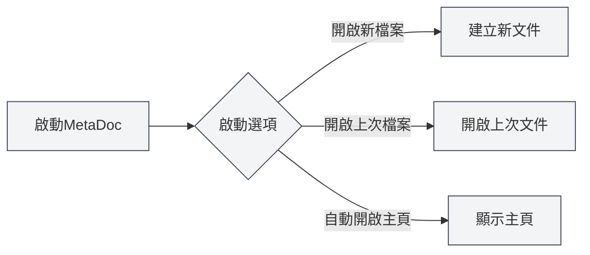
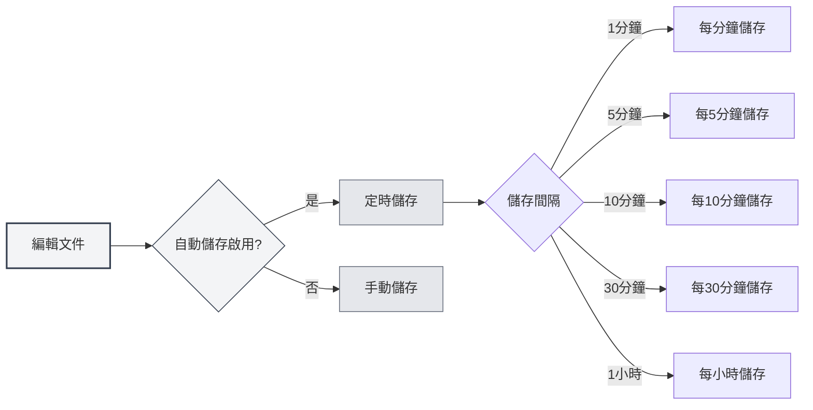
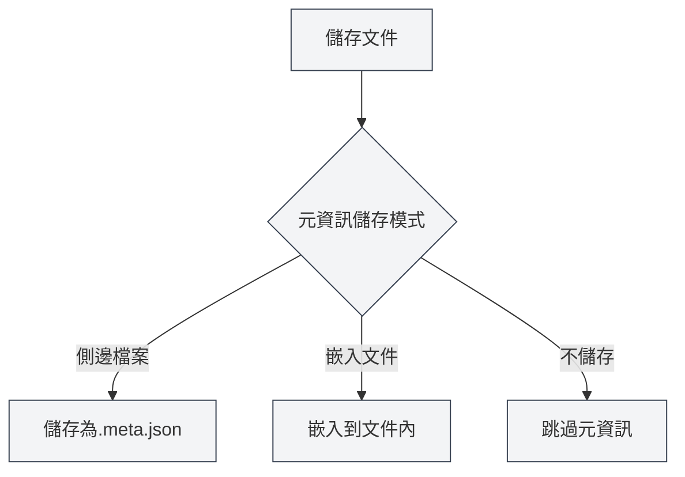

# 基礎設定

## 概述

基礎設定是 MetaDoc 的核心配置選項，涵蓋了應用的啟動行為、自動儲存、文件統計、元資訊管理等重要功能。合理配置這些選項能夠提升您的使用體驗和工作效率。

## 啟動選項

### 設定啟動行為

啟動選項決定了 MetaDoc 啟動時的預設行為：

- **開啟新檔案**：每次啟動時建立一個新的空白文件
- **開啟上次編輯的檔案**：啟動時自動開啟上次關閉時正在編輯的文件

您可以根據使用習慣選擇合適的啟動選項。如果您經常需要從上次的工作繼續，建議選擇「開啟上次編輯的檔案」。

您可以透過頂端選單列存取設定：

<MenuItemsDemo mode="demo" :items='[{"id": "settings"}]' />

### 基礎設定介面

下圖展示了基礎設定頁面的完整介面：

<SettingBasicSection mode="demo" />

基礎設定介面包含以下主要配置區域：

- **啟動選項**：設定應用啟動時的預設行為（開啟新檔案/上次編輯的檔案）
- **自動儲存**：配置自動儲存的時間間隔，防止資料遺失
- **元資料儲存**：選擇元資料的儲存方式（文件內/獨立檔案）
- **引用目錄**：管理文件引用的外部檔案儲存位置
- **其他選項**：程式碼區塊處理、圖片嵌入、數學公式等高級設定

### 啟動時自動開啟主頁

啟用此選項後，MetaDoc 啟動時會自動開啟主頁標籤頁。主頁提供了快速開始、最近文件列表等功能，方便您快速存取常用功能。

## 自動儲存

<SettingBasicSection mode="demo" />

### 配置自動儲存

自動儲存功能可以防止因意外情況（如程式崩潰、斷電等）導致的內容遺失。MetaDoc 支援以下自動儲存間隔：

- **關閉**：不自動儲存，需要手動儲存
- **1分鐘**：每分鐘自動儲存一次
- **5分鐘**：每5分鐘自動儲存一次
- **10分鐘**：每10分鐘自動儲存一次
- **30分鐘**：每30分鐘自動儲存一次
- **1小時**：每小時自動儲存一次

### 使用建議

- **頻繁編輯**：建議設定較短的自動儲存間隔（1-5分鐘），確保內容及時儲存
- **長時間寫作**：可以設定較長的間隔（10-30分鐘），減少磁碟寫入頻率
- **重要文件**：建議啟用自動儲存，並配合手動儲存（`Ctrl+S`）確保資料安全

自動儲存會在背景靜默進行，不會打斷您的編輯工作。

## 文件統計設定

<SettingBasicSection mode="demo" />

### 排除程式碼區塊統計

啟用此選項後，在統計文件字數、詞頻等資訊時，會排除程式碼區塊中的內容。這對於技術文件特別有用，因為程式碼區塊中的內容通常不應該計入文件的文字統計。

**使用場景**：

- 技術文件中包含大量程式碼範例
- 需要準確統計文件的實際文字內容
- 避免程式碼影響詞頻分析結果

## 圖片處理設定

<SettingBasicSection mode="demo" />

### 解析嵌入圖片（OCR功能）

啟用此選項後，MetaDoc 會對文件中嵌入的圖片進行 OCR（光學字元辨識）處理，提取圖片中的文字內容。這對於處理包含圖片的文件（如 PDF、Word 文件）特別有用。

**功能說明**：

- 上傳的 DOCX、PPTX、PDF 檔案中的圖片會被 OCR 處理
- 直接上傳的圖片檔案仍會進行 OCR 處理（不受此選項影響）
- OCR 結果可用於知識庫檢索和 AI 輔助功能

**注意事項**：

- OCR 處理需要一定的計算資源，可能會影響文件載入速度
- 如果不需要提取圖片中的文字，可以關閉此功能以提升效能

### 數學公式行內數字

啟用此選項後，數學公式中的數字會以行內模式顯示，而不是區塊級模式。這可以讓公式更好地融入文字流，適合在段落中插入簡單的數學表達式。

## 元資訊儲存模式

<SettingBasicSection mode="demo" />

### 設定儲存方式

文件元資訊（標題、作者、描述、關鍵字等）可以以三種方式儲存：

- **側邊檔案**：將元資訊儲存在文件同目錄下的獨立檔案中（`.meta.json`）
  - 優點：不影響原文件內容，便於版本控制
  - 缺點：需要同時管理兩個檔案
- **嵌入文件**：將元資訊嵌入到文件檔案內部
  - 優點：單檔案管理，便於分享
  - 缺點：某些格式可能不支援嵌入
- **不儲存**：不儲存元資訊
  - 適用場景：臨時文件或不需要元資訊的文件

### 選擇建議

- **技術文件**：推薦使用「側邊檔案」模式，便於 Git 等版本控制系統管理
- **個人筆記**：可以使用「嵌入文件」模式，保持單檔案整潔
- **臨時文件**：可以選擇「不儲存」模式

## 引用檔案目錄管理

<SettingBasicSection mode="demo" />

### 檢視目錄資訊

引用檔案目錄用於儲存文件中引用的外部檔案（如圖片、附件等）。在基礎設定頁面，您可以：

- **檢視目錄大小**：顯示引用檔案目錄佔用的磁碟空間
- **重新整理**：更新目錄大小資訊
- **開啟目錄**：在檔案管理器中開啟引用檔案目錄
- **清空目錄**：刪除目錄中的所有檔案（操作不可恢復）

### 使用場景

引用檔案目錄通常用於：

- 儲存文件中插入的圖片
- 儲存文件附件
- 管理文件相關的資源檔案

**注意事項**：

- 清空目錄操作不可恢復，請謹慎操作
- 清空前建議先備份重要檔案
- 目錄大小會隨著文件中引用的檔案增加而增長

## 注意事項

1. **啟動選項**：變更啟動選項後，下次啟動應用時才會生效
2. **自動儲存**：自動儲存不會覆蓋您的手動儲存操作，兩者可以配合使用
3. **元資訊模式**：變更元資訊儲存模式後，新儲存的文件會使用新模式，已有文件不受影響
4. **引用目錄**：清空引用目錄前，請確保沒有文件正在使用這些檔案

## 相關文件

- [[core.file-operations|檔案操作]]
- [[core.document-metadata|文件元資訊]]
- [[settings.theme|主題設定]]
- [[settings.image|圖片設定]]

<MenuItemsDemo mode="demo" :items='[{"id": "settings", "items": ["basic"]}]' />
