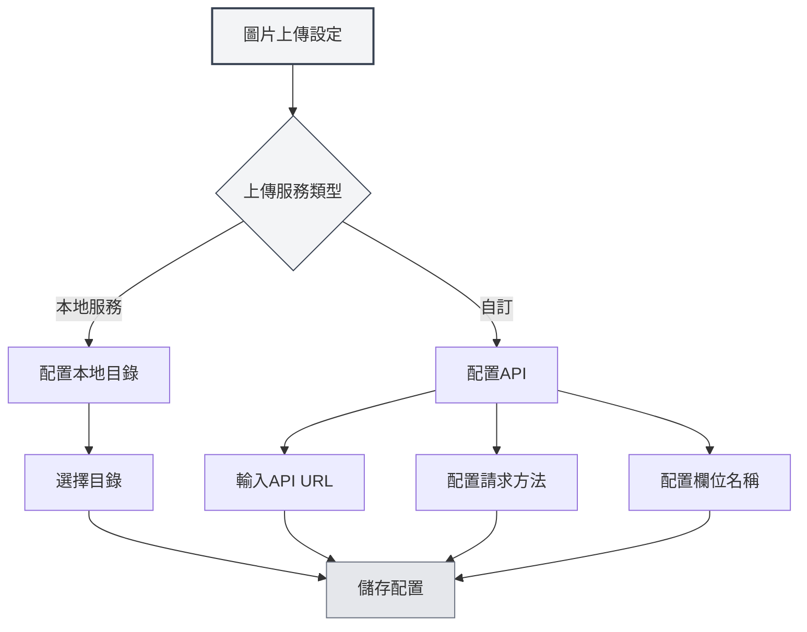

# 上傳服務設定

## 概述

上傳服務設定允許您設定圖片上傳的目標服務。MetaDoc支援本地服務和自訂API兩種上傳方式，您可以根據需求選擇合適的服務。

## 上傳服務類型

### 服務選擇

在圖片設定頁面，當"插入圖片操作"設定為"上傳"時，可以選擇上傳服務：

- **本地服務**：將圖片儲存到本地目錄
- **自訂**：使用自訂API上傳圖片

您可以透過頂端選單列存取圖片上傳設定：

<MenuItemsDemo mode="demo" :items='[{"id": "settings"}]' />



### 本地服務

本地服務將圖片儲存到本地檔案系統：

- **優點**：完全本地控制，資料安全
- **缺點**：需要配置本地目錄
- **適用場景**：本地使用、資料隱私要求高

<SettingImageSection mode="demo" />

### 自訂服務

自訂服務使用外部API上傳圖片：

- **優點**：可以上傳到雲端儲存、圖床等
- **缺點**：需要配置API介面
- **適用場景**：需要雲端儲存、圖片CDN等

<MainTabs mode="demo" />

## 本地圖片目錄配置

### 設定目錄

使用本地服務時，需要配置圖片儲存目錄：

1. 在圖片設定頁面，選擇"本地服務"
2. 點擊"瀏覽"按鈕選擇目錄
3. 或直接在輸入框中輸入目錄路徑
4. 點擊"開啟"按鈕可以在檔案管理員中開啟目錄

### 目錄選擇

選擇圖片目錄時：

- **瀏覽按鈕**：開啟目錄選擇對話方塊
- **路徑輸入**：直接輸入目錄路徑
- **開啟按鈕**：在檔案管理員中開啟已設定的目錄

### 預設目錄

如果不設定本地圖片目錄，系統會使用預設目錄：

- **Windows**：`%APPDATA%/MetaDoc/images`
- **macOS**：`~/Library/Application Support/MetaDoc/images`
- **Linux**：`~/.config/MetaDoc/images`

<QuickStartPanel mode="demo" />

### 目錄管理

- **檢視目錄**：點擊"開啟"按鈕檢視目錄內容
- **變更目錄**：點擊"瀏覽"按鈕選擇新目錄
- **目錄要求**：確保目錄存在且有寫入權限

## 自訂上傳API配置

### API URL配置

使用自訂服務時，需要配置API位址：

1. 在圖片設定頁面，選擇"自訂"服務
2. 在"自訂上傳API URL"輸入框中輸入API位址
3. 格式範例：`https://api.example.com/upload`

### API方法配置

配置API請求方法：

- **POST**：使用POST方法上傳（推薦）
- **PUT**：使用PUT方法上傳

大多數API使用POST方法，某些特殊API可能使用PUT方法。

### 欄位名稱配置

配置上傳檔案的欄位名稱：

- **預設值**：`file`
- **自訂**：根據API要求設定欄位名稱

不同的API可能使用不同的欄位名稱，如`file`、`image`、`upload`等。

### API配置範例

**範例1：標準圖床API**

```
API URL: https://api.example.com/upload
方法: POST
欄位名稱: file
```

**範例2：自訂欄位名稱API**

```
API URL: https://api.example.com/image
方法: POST
欄位名稱: image
```

**範例3：PUT方法API**

```
API URL: https://api.example.com/upload
方法: PUT
欄位名稱: file
```

<ViewMenuItemsDemo mode="demo" :items='["home", "editor"]'
/>

## API回應格式

### 回應要求

自訂API需要回傳以下格式的JSON回應：

```json
{
  "success": true,
  "imagePath": "https://example.com/image.png"
}
```

### 回應欄位

- **success**：布林值，表示上傳是否成功
- **imagePath**：字串，回傳圖片的URL或路徑

### 錯誤處理

如果上傳失敗，API應回傳：

```json
{
  "success": false,
  "message": "錯誤訊息"
}
```

<DialogDemo mode="demo" dialogType="api-config" />

## 配置驗證

### 測試配置

配置自訂API後，建議測試配置：

1. 在文件中插入一張圖片
2. 檢視上傳結果
3. 如果失敗，檢查配置是否正確

### 常見問題

**連線失敗**：

- 檢查API URL是否正確
- 檢查網路連線
- 檢查API服務是否正常執行

**上傳失敗**：

- 檢查API方法是否正確
- 檢查欄位名稱是否正確
- 檢查API回應格式是否符合要求

**權限問題**：

- 檢查API是否需要認證
- 檢查API Key或Token是否正確

<SettingBasicSection mode="demo" />

## 本地服務配置

### 目錄權限

使用本地服務時，確保目錄有寫入權限：

- **Windows**：檢查資料夾權限設定
- **macOS/Linux**：檢查目錄權限（chmod）

### 目錄結構

本地服務會在指定目錄儲存圖片：

- **檔案命名**：使用時間戳+原檔案名稱
- **檔案格式**：保持原始格式
- **目錄結構**：所有圖片儲存在同一目錄

<OcrWindow mode="demo" />

### 圖片存取

本地服務的圖片可以透過以下方式存取：

- **HTTP服務**：透過執行時伺服器的 `/images/` 路徑存取（預設位址由應用配置，如 `http://127.0.0.1:52521/images/`）
- **檔案路徑**：直接使用檔案系統路徑

## 最佳實踐

1. **本地使用**：本地使用推薦本地服務
2. **雲端儲存**：需要雲端儲存時使用自訂API
3. **目錄管理**：定期清理圖片目錄，避免佔用過多空間
4. **API測試**：配置自訂API後先測試
5. **備份策略**：重要圖片建議同時備份

<MenuItemsDemo mode="demo" :items='[{"id": "file", "items": ["new", "open", "save"]}]' />

## 注意事項

1. **配置生效**：配置變更後，新插入的圖片才會使用新配置
2. **API相容性**：確保自訂API符合回應格式要求
3. **目錄權限**：確保本地目錄有寫入權限
4. **網路連線**：自訂API需要網路連線
5. **儲存空間**：本地服務會佔用本地儲存空間

## 相關文件

- [[settings.image|圖片上傳配置]]
- [[settings.basic|基礎設定]]
- [[core.file-operations|檔案操作]]

<ResizableDivider mode="demo" />