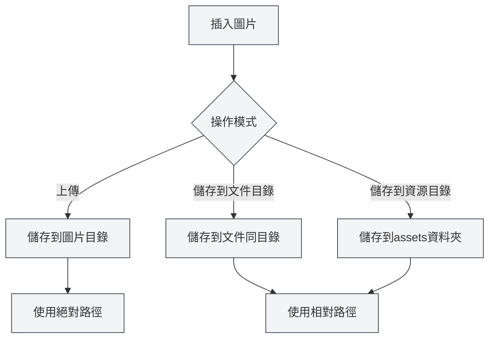

# 圖片上傳配置

## 概述

圖片上傳配置決定了在文件中插入圖片時的處理方式。MetaDoc支援多種圖片處理模式，您可以根據需求選擇合適的配置。

## 插入圖片操作

### 操作模式

插入圖片時，可以選擇以下操作模式：

- **上傳**：將圖片上傳到指定的圖片目錄
- **儲存到文件目錄**：將圖片儲存到文件所在的目錄
- **儲存到資源目錄**：將圖片儲存到文件目錄下的`assets`資料夾

您可以透過頂端選單列存取圖片設定：

<MenuItemsDemo mode="demo" :items='[{"id": "settings"}]' />

### 圖片設定介面

下圖展示了圖片設定頁面的完整介面：

<SettingImageSection mode="demo" />

圖片設定介面包含以下主要配置區域：

- **圖片上傳服務**：選擇本機儲存或第三方圖床
- **本機儲存路徑**：設定圖片儲存的本機目錄
- **網路圖片處理**：配置是否保留原URL、是否自動轉存等選項

### 上傳模式

上傳模式會將圖片儲存到配置的本機圖片目錄：

- **優點**：集中管理所有圖片，便於備份和遷移
- **缺點**：圖片與文件分離，移動文件時需要同時移動圖片
- **適用場景**：多文件共享圖片、圖片資源集中管理

<DialogDemo mode="demo" dialogType="image-upload" />

### 儲存到文件目錄

將圖片儲存到文件所在的目錄：

- **優點**：圖片與文件在同一目錄，便於管理
- **缺點**：每個文件目錄都有圖片，可能重複
- **適用場景**：單文件專案、文件需要獨立打包

<DialogDemo mode="demo" dialogType="file-save" />

### 儲存到資源目錄

將圖片儲存到文件目錄下的`assets`資料夾：

- **優點**：圖片統一存放在`assets`資料夾，結構清晰
- **缺點**：需要建立`assets`資料夾
- **適用場景**：需要清晰的檔案結構、文件需要匯出分享

<DialogDemo mode="demo" dialogType="folder-select" />

## 保留網路圖片URL

### 功能說明

啟用"保留網路圖片URL"後，插入網路圖片時不會下載圖片，而是直接使用原始URL：

- **啟用**：保留網路圖片的原始URL，不下載到本機
- **停用**：下載網路圖片到本機，使用本機路徑

### 使用場景

- **啟用場景**：

  - 圖片資源較大，不需要本機備份
  - 圖片會定期更新，需要即時顯示最新版本
  - 節省本機儲存空間

- **停用場景**：
  - 需要離線存取圖片
  - 需要備份圖片資源
  - 網路圖片可能失效

### 注意事項

- 保留網路URL時，需要網路連線才能顯示圖片
- 如果網路圖片失效，文件中的圖片將無法顯示
- 建議重要圖片停用此選項，確保圖片可用性

## 自動跳脫圖片URL

### 功能說明

啟用"自動跳脫圖片URL"後，插入圖片時會自動跳脫URL中的特殊字元：

- **啟用**：自動跳脫URL中的特殊字元（如空格、中文字元等）
- **停用**：保持URL原樣，不進行跳脫

### 跳脫規則

系統會自動跳脫以下字元：

- **空格**：轉換為`%20`
- **中文字元**：進行URL編碼
- **特殊字元**：跳脫為URL安全格式

### 使用建議

- **啟用**：推薦啟用，確保URL在各種環境下都能正確解析
- **停用**：僅在確定URL格式正確且不需要跳脫時停用

## 路徑格式

### 絕對路徑

使用上傳模式時，圖片使用絕對路徑：

- **格式**：`/path/to/image.png`
- **優點**：路徑明確，不受文件位置影響
- **缺點**：移動文件或圖片後路徑失效

### 相對路徑

使用儲存到文件目錄或資源目錄時，圖片使用相對路徑：

- **格式**：`./image.png` 或 `./assets/image.png`
- **優點**：文件和圖片可以一起移動
- **缺點**：文件位置改變後需要調整路徑

## 配置生效

### 生效時機

圖片上傳配置的更改會在以下情況生效：

- **新插入的圖片**：立即使用新配置
- **已開啟的文件**：需要重新開啟文件才能生效
- **已儲存的文件**：已儲存的文件不受影響

### 重新開啟檔案

某些配置更改需要重新開啟檔案才能生效：

1. 修改圖片上傳配置
2. 關閉目前文件
3. 重新開啟文件
4. 新配置生效

## 最佳實踐

1. **統一管理**：使用上傳模式集中管理圖片
2. **文件獨立**：需要文件獨立時，使用儲存到文件目錄
3. **結構清晰**：使用資源目錄模式保持檔案結構清晰
4. **網路圖片**：重要圖片建議停用保留URL選項
5. **路徑跳脫**：建議啟用自動跳脫，確保相容性

## 注意事項

1. **配置生效**：某些配置需要重新開啟檔案才能生效
2. **路徑格式**：注意絕對路徑和相對路徑的區別
3. **網路圖片**：保留網路URL時，需要網路連線
4. **圖片備份**：重要圖片建議停用保留URL，確保備份
5. **儲存空間**：上傳模式會佔用本機儲存空間

## 相關文件

- [[settings.image-upload|上傳服務設定]]
- [[settings.basic|基礎設定]]
- [[core.file-operations|檔案操作]]

<SettingImageSection mode="demo" />

<MenuItemsDemo mode="demo" :items='[{"id": "settings", "items": ["image"]}]' />

<DialogDemo mode="demo" dialogType="image-upload" />

<DialogDemo mode="demo" dialogType="file-save" />