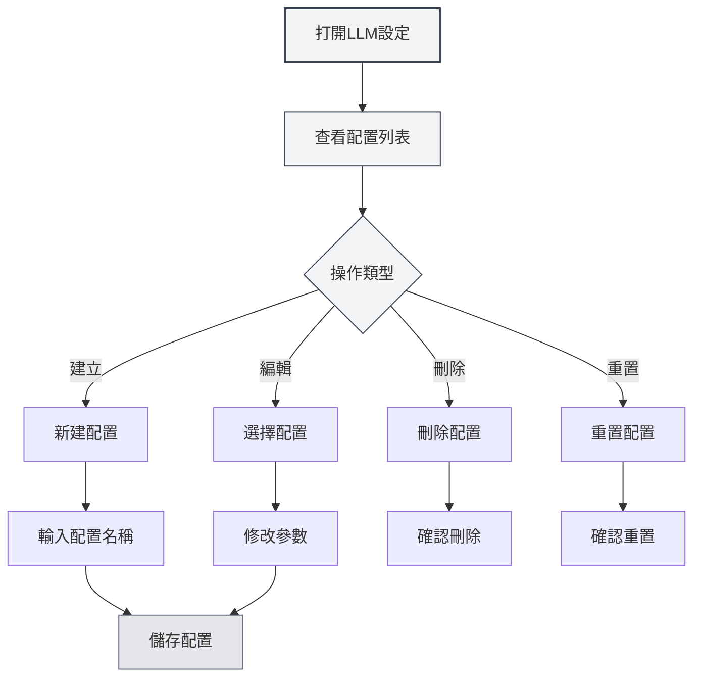

# LLM配置管理

## 概述

LLM配置管理允許您建立、編輯、刪除和管理多個LLM配置。透過配置管理，您可以為不同的使用場景設定不同的LLM服務，靈活切換以滿足各種需求。

## 建立配置

### 建立新配置

1.  在LLM設定頁面，點擊左側配置列表上方的「新建配置」按鈕（+圖示）
2.  在彈出的對話框中輸入配置名稱
3.  系統會基於目前設定建立新配置
4.  建立成功後，會自動切換到新配置

您可以透過頂端選單列存取LLM設定：

<MenuItemsDemo mode="demo" :items='[{"id": "settings"}]' />

### 配置介面演示

下圖展示了LLM配置管理介面的主要功能：

<SettingLlmSection mode="demo" />

**注意事項**：

-   配置名稱不能為空
-   配置名稱應該具有描述性，便於識別
-   新建的配置會繼承目前的所有設定
-   手動配置類型（manual）不支援建立新配置



### 從目前設定建立

建立新配置時，系統會：

-   複製目前選中的LLM類型
-   複製目前的所有配置參數（API URL、API Key、模型等）
-   建立新的配置ID
-   將新配置新增到配置列表

您可以基於現有配置建立新配置，然後修改參數，這樣可以快速建立相似的配置。

<DialogDemo mode="demo" dialogType="llm-config" />

## 編輯配置

### 修改配置參數

1.  在配置列表中選擇要編輯的配置
2.  在右側表單中修改各項參數
3.  修改後，系統會標記為「未儲存變更」
4.  點擊「儲存變更」按鈕儲存修改

<DialogDemo mode="demo" dialogType="api-config" />

### 配置參數說明

不同LLM類型的配置參數不同：

-   **MetaDoc API**：模型選擇
-   **Ollama**：API URL、模型選擇、最大Token數
-   **OpenAI相容**：API URL、API Key、模型選擇、後綴配置
-   **OpenAI官方**：API Key、模型選擇
-   **DeepSeek**：API Key、模型選擇
-   **Gemini**：API Key、模型選擇

### 即時預覽

修改配置參數時，系統會即時偵測變更：

-   有未儲存變更時會顯示警告標籤
-   可以隨時點擊「放棄變更」恢復原狀
-   儲存後變更立即生效

<AIChat mode="demo" />

## 刪除配置

### 刪除配置

1.  點擊配置項右側的「更多」按鈕（三個點圖示）
2.  選擇「刪除配置」
3.  確認刪除操作

**限制條件**：

-   至少需要保留一個配置，不能刪除最後一個配置
-   預設配置（isDefault）不能刪除，只能重置
-   刪除操作不可恢復，請謹慎操作

### 刪除確認

刪除配置前，系統會要求您確認：

-   確認刪除後，配置將被永久刪除
-   如果刪除的是目前使用的配置，系統會自動切換到其他配置
-   刪除後無法恢復，請確保不再需要該配置

<DialogDemo mode="demo" dialogType="confirm-delete" />

## 重置配置

### 重置預設配置

對於預設配置（如「Ollama (預設)」），您可以將其重置為初始值：

1.  點擊配置項右側的「更多」按鈕
2.  選擇「重置配置」
3.  確認重置操作

重置後，配置會恢復到建立時的預設值，所有自訂修改將被清除。

**適用場景**：

-   配置被意外修改，需要恢復預設值
-   測試配置後需要重置
-   清理不需要的自訂設定

## 匯出配置

### 匯出單一配置

1.  點擊配置項右側的「更多」按鈕
2.  選擇「匯出配置」
3.  系統會產生JSON格式的配置檔案
4.  儲存檔案到本機

<DialogDemo mode="demo" dialogType="export-config" />

匯出的配置檔案包含：

-   配置ID和名稱
-   LLM類型
-   所有配置參數
-   建立和更新時間

### 匯出所有配置

1.  點擊配置列表上方的「匯出所有配置」按鈕（下載圖示）
2.  系統會匯出所有配置到一個JSON檔案
3.  儲存檔案到本機

匯出所有配置可以用於：

-   備份所有配置
-   遷移到其他裝置
-   分享配置給其他使用者

## 匯入配置

### 匯入配置

1.  點擊配置列表上方的「匯入配置」按鈕（文件複製圖示）
2.  選擇之前匯出的配置檔案
3.  系統會解析並匯入配置
4.  匯入的配置會新增到配置列表

<DialogDemo mode="demo" dialogType="import-config" />

**匯入規則**：

-   支援匯入單一配置或配置陣列
-   如果匯入的配置ID已存在，會建立新ID避免衝突
-   匯入後需要手動切換到新配置

### 匯入格式

配置檔案應為JSON格式，支援以下結構：

```json
{
  "id": "config-xxx",
  "name": "配置名稱",
  "type": "ollama",
  "ollama": {
    "apiUrl": "http://localhost:11434/api",
    "selectedModel": "llama2"
  }
}
```

或配置陣列：

```json
[
  { "id": "config-1", ... },
  { "id": "config-2", ... }
]
```

## 配置排序

### 拖曳排序

配置列表支援拖曳排序：

1.  點擊並按住配置項
2.  拖曳到目標位置
3.  釋放滑鼠完成排序

排序後的順序會儲存，下次開啟設定頁面時會保持。

**使用場景**：

-   將常用配置放在頂部
-   按使用頻率排序
-   按LLM類型分組

## 配置狀態

### 目前配置

目前正在使用的配置會：

-   在列表中高亮顯示
-   顯示「未儲存變更」標籤（如果有未儲存修改）
-   所有AI功能使用此配置的LLM服務

### 配置切換

切換配置時：

-   系統會檢查目前配置是否有未儲存變更
-   如果有未儲存變更，建議先儲存或放棄
-   切換後立即生效，所有AI功能使用新配置

## 最佳實踐

1.  **命名規範**：使用清晰的配置名稱，如「工作-Ollama」、「實驗-OpenAI」
2.  **定期備份**：重要配置定期匯出備份
3.  **測試配置**：新配置建立後先測試，確認可用後再使用
4.  **清理無用配置**：定期刪除不再使用的配置，保持列表整潔
5.  **文件記錄**：為複雜配置新增備註或文件說明

## 注意事項

1.  **配置安全**：包含API Key的配置請妥善保管，不要分享
2.  **配置衝突**：匯入配置時注意ID衝突問題
3.  **預設配置**：預設配置不能刪除，只能重置
4.  **配置依賴**：某些功能可能依賴特定配置，刪除前請確認
5.  **多視窗同步**：配置修改會在所有視窗間同步

## 相關文件

-   [[settings.llm|LLM配置]]
-   [[settings.llm-types|LLM類型配置]]
-   [[ai.chat|AI對話功能]]
-   [[agent.config|Agent配置管理]]

<QuickStartPanel mode="demo" />

<MainTabs mode="demo" />