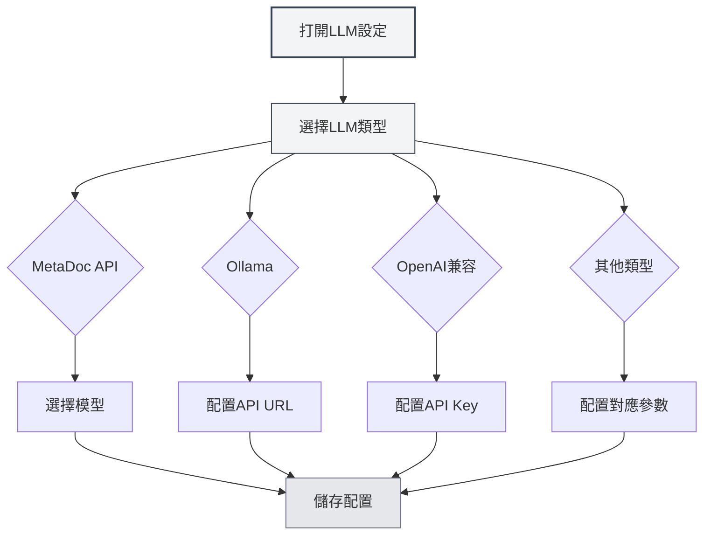

# LLM類型配置

## 概述

MetaDoc支援多種LLM服務提供商，每種類型都有不同的配置要求。本文檔介紹如何配置各種LLM類型，包括MetaDoc API、Ollama、OpenAI、DeepSeek和Gemini。

## MetaDoc API

### 配置說明

MetaDoc API是MetaDoc官方提供的LLM服務，使用簡單，無需配置API金鑰。

### 配置步驟

1. 在LLM類型下拉框中選擇"MetaDoc"
2. 在"選擇模型"下拉框中選擇可用的模型
3. 配置最大Token數（可選）

您可以透過頂端選單列存取LLM設定：

<MenuItemsDemo mode="demo" :items='[{"id": "settings"}]' />

### LLM配置介面演示

下圖展示了LLM配置頁面的主要功能區域：

<SettingLlmSection mode="demo" />

### 配置要求

- **登入帳戶**：需要登入MetaDoc帳戶才能使用
- **模型選擇**：從可用模型清單中選擇
- **最大Token數**：可選，限制單次請求的最大Token數

<MainTabs mode="demo" />

### 適用場景

- 快速開始使用AI功能
- 不需要配置外部服務
- 使用MetaDoc官方服務

<DialogDemo mode="demo" dialogType="llm-config" />

## Ollama

### 配置說明

Ollama是一個本地LLM執行環境，可以在本地執行大型語言模型，無需網路連線。

### 配置步驟

1. 在LLM類型下拉框中選擇"Ollama"
2. 配置API基礎URL（預設：`http://localhost:11434/api`）
3. 點擊"選擇模型"下拉框，系統會自動取得本地可用的模型清單
4. 選擇要使用的模型
5. 配置最大Token數（可選）

### 配置要求

- **安裝Ollama**：需要先安裝Ollama並啟動服務
- **API URL**：預設是 `http://localhost:11434/api`，如果Ollama執行在其他地址，需要修改
- **模型下載**：需要先使用Ollama下載模型（如：`ollama pull llama2`）

### 取得模型清單

點擊"選擇模型"下拉框時，MetaDoc會自動連線到Ollama服務並取得可用模型清單。如果連線失敗，請檢查：

- Ollama服務是否正在執行
- API URL是否正確
- 網路連線是否正常

### 適用場景

- 本地執行LLM，保護資料隱私
- 不需要網路連線
- 有足夠的計算資源（推薦GPU）

<DialogDemo mode="demo" dialogType="api-config" />

## OpenAI兼容

### 配置說明

OpenAI兼容API支援所有兼容OpenAI API格式的服務，包括OpenAI官方API和第三方兼容服務。

### 配置步驟

1. 在LLM類型下拉框中選擇"OpenAI兼容"
2. 配置API基礎URL（預設：`https://api.openai.com/v1`）
3. 輸入API Key
4. 點擊"選擇模型"下拉框取得可用模型清單
5. 選擇要使用的模型
6. 配置Completion後綴和Chat後綴（可選，用於自訂API路徑）
7. 配置最大Token數（可選）

### 配置要求

- **API URL**：OpenAI官方API或兼容服務的API地址
- **API Key**：從服務提供商取得的API金鑰
- **模型清單**：系統會自動取得可用模型清單

### API後綴配置

某些兼容服務可能需要自訂API路徑：

- **Completion後綴**：用於Completion API的自訂路徑後綴
- **Chat後綴**：用於Chat API的自訂路徑後綴

大多數情況下不需要配置，使用預設值即可。

### 適用場景

- 使用OpenAI官方API
- 使用兼容OpenAI API的第三方服務
- 需要自訂API路徑的服務

<MainTabs mode="demo" />

## OpenAI官方

### 配置說明

OpenAI官方配置專門用於OpenAI官方API，配置更簡單，API URL固定。

### 配置步驟

1. 在LLM類型下拉框中選擇"OpenAI官方"
2. 輸入OpenAI API Key
3. 點擊"選擇模型"下拉框取得可用模型清單
4. 選擇要使用的模型
5. 配置最大Token數（可選）

### 配置要求

- **API Key**：從OpenAI官網取得的API金鑰
- **API URL**：固定為 `https://api.openai.com/v1`，不可修改

### 取得API Key

1. 造訪 [OpenAI官網](https://platform.openai.com/)
2. 註冊或登入帳戶
3. 進入API Keys頁面
4. 建立新的API Key
5. 複製API Key並貼上到MetaDoc配置中

<ResizableDivider mode="demo" />

### 適用場景

- 使用OpenAI官方GPT模型
- 需要穩定的官方服務
- 有OpenAI帳戶和API配額

## DeepSeek

### 配置說明

DeepSeek是一個高效能的LLM服務提供商，提供強大的中文理解能力。

### 配置步驟

1. 在LLM類型下拉框中選擇"DeepSeek"
2. 輸入DeepSeek API Key
3. 選擇模型（deepseek-chat 或 deepseek-reasoner）
4. 配置最大Token數（可選）

### 配置要求

- **API Key**：從DeepSeek官網取得的API金鑰
- **模型選擇**：
  - `deepseek-chat`：通用對話模型
  - `deepseek-reasoner`：推理模型

### 取得API Key

1. 造訪 [DeepSeek官網](https://www.deepseek.com/)
2. 註冊或登入帳戶
3. 進入API Keys頁面
4. 建立新的API Key
5. 複製API Key並貼上到MetaDoc配置中

### 適用場景

- 需要強大的中文理解能力
- 需要推理能力（使用deepseek-reasoner）
- 性價比高的LLM服務

<SettingKnowledgeBaseSection mode="demo" />

<CompletionSettingsPanel mode="demo" />

## Gemini

### 配置說明

Gemini是Google提供的LLM服務，支援多模態能力。

### 配置步驟

1. 在LLM類型下拉框中選擇"Gemini"
2. 輸入Gemini API Key
3. 點擊"選擇模型"下拉框取得可用模型清單
4. 選擇要使用的模型
5. 配置最大Token數（可選）

### 配置要求

- **API Key**：從Google AI Studio取得的API金鑰
- **模型選擇**：系統會自動取得可用模型清單

### 取得API Key

1. 造訪 [Google AI Studio](https://makersuite.google.com/app/apikey)
2. 使用Google帳戶登入
3. 建立新的API Key
4. 複製API Key並貼上到MetaDoc配置中

### 適用場景

- 使用Google的LLM服務
- 需要多模態能力
- 有Google帳戶

<AgentView mode="demo" />

## 最大Token數配置

### 功能說明

最大Token數限制單次請求可以產生的最大Token數量。啟用此功能可以：

- 控制產生內容的長度
- 節省API費用
- 避免產生過長的內容

### 配置方式

1. 啟用"最大Token數"開關
2. 設定Token數量（範圍：1-32768）
3. 儲存配置

### 使用建議

- **短文字產生**：100-500 tokens
- **中等長度**：500-2000 tokens
- **長文字產生**：2000-8000 tokens
- **無限制**：關閉此選項

## 配置驗證

### 測試配置

配置完成後，建議測試配置是否正常：

1. 儲存配置
2. 啟用LLM功能
3. 嘗試使用AI對話功能
4. 如果出現錯誤，檢查配置是否正確

### 常見問題

**連線失敗**：

- 檢查API URL是否正確
- 檢查網路連線
- 檢查服務是否正常執行

**認證失敗**：

- 檢查API Key是否正確
- 檢查API Key是否過期
- 檢查帳戶是否有足夠的配額

**模型不可用**：

- 檢查模型名稱是否正確
- 檢查帳戶是否有權限使用該模型
- 檢查服務是否支援該模型

## 注意事項

1. **API金鑰安全**：請妥善保管API金鑰，不要分享給他人
2. **費用控制**：使用外部API可能產生費用，請注意使用量
3. **網路要求**：使用外部API需要穩定的網路連線
4. **服務可用性**：不同服務的可用性和穩定性可能不同
5. **模型選擇**：不同模型有不同的能力和限制，請根據需求選擇

## 相關文件

- [[settings.llm|LLM配置]]
- [[settings.llm-management|LLM配置管理]]
- [[ai.chat|AI對話功能]]
- [[ai.completion|AI自動補全]]

<MenuItemsDemo mode="demo" :items='[{"id": "file"}]' />

<ViewMenuItemsDemo mode="demo" :items='["settings"]' />

<SettingLlmSection mode="demo" />

<DialogDemo mode="demo" dialogType="llm-config" />

<MainTabs mode="demo" />
