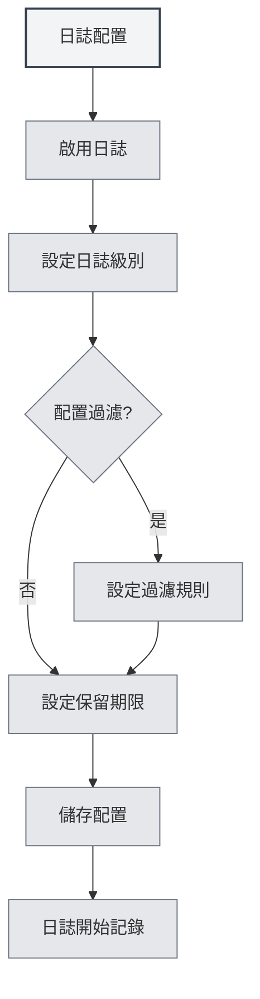

# 日誌配置

## 概述

日誌配置允許您管理 MetaDoc 的日誌記錄功能。透過配置日誌，您可以記錄應用的運行狀態，便於問題排查和效能分析。

<Demo component="SettingLoggerSection" mode="demo" />

## 啟用日誌

### 開啟日誌功能

在日誌設定頁面，首先需要啟用日誌功能：

1.  找到「啟用日誌」開關
2.  將開關切換到「啟用」狀態
3.  日誌會開始記錄到檔案

您可以透過頂端選單列存取日誌設定：

<MenuItemsDemo mode="demo" :items='[{"id": "settings"}]' />

啟用日誌後，系統會記錄應用的運行資訊，包括：

-   操作記錄
-   錯誤資訊
-   警告資訊
-   除錯資訊（如果啟用）



**注意事項**：

-   日誌會佔用一定的磁碟空間
-   建議在需要排查問題時啟用
-   生產環境可以關閉以減少資源佔用

## 日誌級別

### 級別說明

日誌級別決定了記錄哪些級別的日誌：

<ConsoleTerminal mode="demo" consoleKey="log-levels" :history='[{"content": "[INFO] 應用啟動完成", "type": "out"}, {"content": "[DEBUG] 載入配置檔案", "type": "out"}, {"content": "[WARN] 配置項缺失，使用預設值", "type": "warn"}, {"content": "[ERROR] 連線失敗，正在重試...", "type": "error"}]' />

-   **DEBUG**：詳細的除錯資訊，包括所有操作細節
-   **INFO**：一般資訊，記錄重要的操作和狀態
-   **WARN**：警告資訊，記錄可能的問題
-   **ERROR**：錯誤資訊，記錄錯誤和異常

### 級別優先級

日誌級別有優先級關係：

```
DEBUG < INFO < WARN < ERROR
```

選擇某個級別後，會記錄該級別及更高級別的日誌。例如：

-   選擇 INFO：記錄 INFO、WARN、ERROR
-   選擇 WARN：只記錄 WARN、ERROR
-   選擇 ERROR：只記錄 ERROR

### 級別選擇建議

-   **開發除錯**：使用 DEBUG 級別，取得詳細資訊
-   **日常使用**：使用 INFO 級別，記錄重要操作
-   **問題排查**：使用 WARN 級別，關注警告和錯誤
-   **生產環境**：使用 ERROR 級別，只記錄錯誤

<SettingLoggerSection mode="demo" />

## 日誌過濾

### 過濾功能

日誌過濾允許您只記錄特定範圍的日誌：

-   **按 scope 過濾**：只記錄特定模組的日誌
-   **前綴匹配**：支援前綴匹配，如「ai-graph」會匹配所有以「ai-graph」開頭的 scope
-   **精確匹配**：支援精確匹配，如「[ai-graph][WorkflowTool]」

### 過濾規則

過濾規則支援以下格式：

-   **簡單匹配**：`ai-graph` - 匹配所有包含「ai-graph」的 scope
-   **前綴匹配**：`ai-` - 匹配所有以「ai-」開頭的 scope
-   **精確匹配**：`[ai-graph][WorkflowTool]` - 精確匹配該 scope

### 使用場景

-   **除錯特定模組**：只記錄某個模組的日誌
-   **減少日誌量**：過濾掉不關心的日誌
-   **問題定位**：專注於特定功能的日誌

<SettingDebugSection mode="demo" />

### 過濾範例

**範例 1：只記錄 AI 相關日誌**

```
過濾條件：ai-
```

**範例 2：只記錄工作流日誌**

```
過濾條件：workflow
```

**範例 3：只記錄特定工具的日誌**

```
過濾條件：[ai-graph][WorkflowTool]
```

## 日誌保留期限

### 保留期限設定

日誌保留期限決定了日誌檔案的保留時間：

-   **不保留**：不自動清理日誌
-   **1 天**：保留 1 天的日誌
-   **3 天**：保留 3 天的日誌
-   **7 天**：保留 7 天的日誌
-   **1 個月**：保留 1 個月的日誌
-   **3 個月**：保留 3 個月的日誌
-   **6 個月**：保留 6 個月的日誌
-   **1 年**：保留 1 年的日誌
-   **永久**：永久保留日誌

### 自動清理

設定保留期限後，系統會自動清理過期的日誌檔案：

-   **清理時機**：更改保留期限時立即執行清理
-   **清理規則**：刪除超過保留期限的日誌檔案
-   **清理範圍**：只清理日誌目錄中的檔案

<ConsoleTerminal mode="demo" consoleKey="cleanup" :history='[{"content": "[INFO] 開始清理過期日誌檔案...", "type": "out"}, {"content": "[INFO] 刪除: 2026-02-10 10-30-45.log (超過保留期限)", "type": "out"}, {"content": "[INFO] 刪除: 2026-02-11 14-20-30.log (超過保留期限)", "type": "out"}, {"content": "[INFO] 清理完成，共刪除 2 個檔案", "type": "out"}]' />

### 選擇建議

-   **開發環境**：使用較短的保留期限（1-3 天）
-   **生產環境**：使用中等保留期限（7 天-1 個月）
-   **重要專案**：使用較長的保留期限（3-6 個月）
-   **審計需求**：使用永久保留

## 日誌檔案路徑

### 檢視日誌路徑

在日誌設定頁面，可以檢視：

-   **日誌檔案路徑**：當前日誌檔案的完整路徑
-   **日誌目錄路徑**：日誌檔案所在的目錄路徑

### 開啟日誌檔案

1.  在日誌設定頁面，找到「日誌檔案路徑」
2.  點擊「開啟日誌檔案」按鈕
3.  系統會用預設文字編輯器開啟日誌檔案

### 開啟日誌目錄

1.  在日誌設定頁面，找到「日誌目錄」
2.  點擊「開啟日誌目錄」按鈕
3.  系統會在檔案管理器中開啟日誌目錄

<ViewMenuItemsDemo mode="demo" :items='["home", "editor"]'
/>

## 日誌控制檯

### 即時檢視日誌

日誌設定頁面提供了日誌控制檯，可以即時檢視日誌：

-   **即時顯示**：顯示最新的日誌條目
-   **歷史記錄**：顯示最近的日誌歷史（最多 500 條）
-   **日誌級別**：不同級別的日誌用不同顏色顯示

<ConsoleTerminal mode="demo" consoleKey="realtime-logs" :history='[{"content": "[2026-02-24 10:30:15] [INFO] [main][App] 應用啟動完成", "type": "out"}, {"content": "[2026-02-24 10:30:16] [DEBUG] [renderer][Editor] 編輯器初始化", "type": "out"}, {"content": "[2026-02-24 10:30:18] [INFO] [renderer][Workspace] 載入工作目錄", "type": "out"}]' />

### 控制檯功能

-   **檢視日誌**：即時檢視應用日誌
-   **過濾顯示**：根據日誌級別過濾顯示
-   **搜尋日誌**：在控制檯中搜尋日誌內容

## 日誌檔案格式

### 檔案命名

日誌檔案使用以下命名格式：

```
YYYY-MM-DD HH-mm-ss.log
```

例如：`2026-02-19 14-30-45.log`

### 日誌格式

每條日誌包含以下資訊：

-   **時間戳**：日誌記錄的時間
-   **級別**：日誌級別（DEBUG/INFO/WARN/ERROR）
-   **行程類型**：main（主行程）或 renderer（渲染行程）
-   **Scope**：日誌來源的模組或元件
-   **訊息**：日誌訊息內容

### 日誌範例

```
[2026-02-19 14:30:45] [INFO] [main][Logger] 日誌配置更新: enabled=true, level=info
[2026-02-19 14:30:46] [DEBUG] [renderer][Editor] 文件已儲存
[2026-02-19 14:30:47] [WARN] [main][RAG] 知識庫檔案未找到
[2026-02-19 14:30:48] [ERROR] [renderer][LLM] API 呼叫失敗
```

<ConsoleTerminal mode="demo" consoleKey="log-examples" :history='[{"content": "[2026-02-19 14:30:45] [INFO] [main][Logger] 日誌配置更新: enabled=true, level=info", "type": "out"}, {"content": "[2026-02-19 14:30:46] [DEBUG] [renderer][Editor] 文件已儲存", "type": "out"}, {"content": "[2026-02-19 14:30:47] [WARN] [main][RAG] 知識庫檔案未找到", "type": "warn"}, {"content": "[2026-02-19 14:30:48] [ERROR] [renderer][LLM] API 呼叫失敗", "type": "error"}]' />

## 最佳實踐

1.  **合理設定級別**：根據使用場景選擇合適的日誌級別
2.  **使用過濾**：使用過濾功能減少日誌量
3.  **定期清理**：設定合理的保留期限，避免佔用過多空間
4.  **問題排查**：遇到問題時，暫時提高日誌級別取得詳細資訊
5.  **日誌備份**：重要日誌建議備份儲存

<MainTabs mode="demo" />

## 注意事項

1.  **磁碟空間**：日誌會佔用磁碟空間，注意定期清理
2.  **效能影響**：DEBUG 級別可能影響效能，建議只在除錯時使用
3.  **隱私安全**：日誌可能包含敏感資訊，注意保護日誌檔案
4.  **檔案權限**：確保日誌目錄有寫入權限
5.  **日誌位置**：日誌檔案位置由系統自動管理，不建議手動修改

## 相關文件

-   [[settings.basic|基礎設定]]
-   [[settings.about|關於資訊]]


<ResizableDivider mode="demo" />
