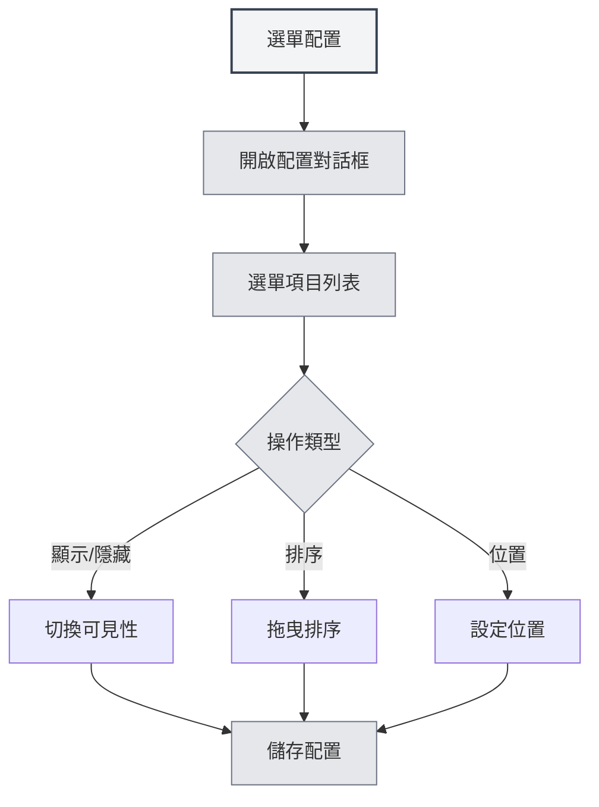

# 選單配置

## 概述

選單配置功能允許您自訂左側選單的顯示和順序。透過選單配置，您可以隱藏不需要的選單項目，調整選單順序，設定選單位置，打造個人化的介面佈局。

## 開啟選單配置

### 存取方式

可以透過以下方式開啟選單配置：

- **設定頁面**：在設定頁面中可能有選單配置入口
- **選單選項**：在左側選單的「更多功能」中可能有選單配置選項
- **右鍵選單**：某些選單項目可能有配置選項

您可以透過頂部選單列存取選單配置：

<MenuItemsDemo mode="demo" :items='[{"id": "settings"}]' />

## 選單項目管理

### 選單項目列表

選單配置頁面顯示所有可配置的選單項目：

- **選單項目名稱**：顯示選單項目的名稱
- **可見性**：顯示選單項目是否可見
- **位置**：顯示選單項目的位置（頂部/底部）
- **核心標識**：標識核心選單項目（不可隱藏）

### 選單項目類型

選單項目分為兩種類型：

- **核心選單項目**：必須顯示的選單項目，不能隱藏
  - 主頁
  - 檔案
  - 設定
  - 更多功能
  - 退出
- **普通選單項目**：可以隱藏的選單項目
  - AI助手
  - 最近檔案
  - 知識庫
  - 工作目錄
  - 使用者手冊
  - 使用者回饋
  - LLM統計
  - 除錯工具（開發環境）

## 顯示/隱藏選單項目

### 隱藏選單項目

可以隱藏不需要的選單項目：

1. **開啟配置**：開啟選單配置對話框
2. **找到選單項目**：找到要隱藏的選單項目
3. **切換可見性**：切換選單項目的可見性開關
4. **儲存配置**：點擊「儲存」按鈕儲存配置

<DialogDemo mode="demo" dialogType="menu-config" />

### 顯示選單項目

可以顯示已隱藏的選單項目：

1. **開啟配置**：開啟選單配置對話框
2. **找到選單項目**：找到要顯示的選單項目
3. **切換可見性**：切換選單項目的可見性開關
4. **儲存配置**：點擊「儲存」按鈕儲存配置

### 核心選單項目限制

核心選單項目不能隱藏：

- **強制顯示**：核心選單項目始終顯示
- **無法隱藏**：核心選單項目的可見性開關會被停用
- **自動恢復**：如果嘗試隱藏核心選單項目，會自動恢復為顯示狀態

## 選單項目排序

### 拖曳排序

可以透過拖曳調整選單項目順序：

1. **開啟配置**：開啟選單配置對話框
2. **拖曳選單項目**：點擊並拖曳選單項目的拖曳手柄
3. **調整位置**：將選單項目拖到目標位置
4. **儲存配置**：點擊「儲存」按鈕儲存配置

### 排序規則

選單項目排序遵循以下規則：

- **位置分組**：頂部選單項目和底部選單項目分開排序
- **分隔線**：頂部和底部之間會有分隔線
- **自動調整**：拖曳到不同位置會自動調整位置屬性

## 選單位置設定

### 位置類型

選單項目可以設定兩種位置：

- **頂部**：顯示在選單列的頂部區域
- **底部**：顯示在選單列的底部區域

### 設定位置

可以設定選單項目的位置：

1. **開啟配置**：開啟選單配置對話框
2. **拖曳到位置**：將選單項目拖曳到頂部或底部區域
3. **自動調整**：系統會自動調整位置屬性
4. **儲存配置**：點擊「儲存」按鈕儲存配置

<LeftMenu mode="demo" />

### 位置分隔線

頂部和底部之間會有分隔線：

- **自動顯示**：如果有頂部和底部選單項目，會自動顯示分隔線
- **不可拖曳**：分隔線不可拖曳，用於視覺分隔
- **自動隱藏**：如果只有頂部或底部選單項目，分隔線會自動隱藏

## 配置儲存

### 自動儲存

某些操作會自動儲存配置：

- **可見性切換**：切換選單項目可見性時自動儲存
- **位置調整**：調整選單位置時自動儲存

### 手動儲存

也可以手動儲存配置：

1. **調整配置**：調整選單項目的順序和可見性
2. **點擊儲存**：點擊「儲存」按鈕
3. **配置生效**：配置會立即生效

### 重設配置

可以重設選單配置：

1. **開啟配置**：開啟選單配置對話框
2. **點擊重設**：點擊「重設」按鈕
3. **確認重設**：確認重設操作
4. **恢復預設**：配置會恢復到預設狀態

**注意事項**：

- 重設操作不可恢復
- 重設後核心選單項目仍然會保持顯示

<DialogDemo mode="demo" dialogType="confirm-reset" />

## 配置持久化

### 配置儲存

選單配置會儲存在本地：

- **本地儲存**：配置儲存在本地設定中
- **自動載入**：下次啟動應用時自動載入配置
- **多視窗同步**：配置會在所有視窗間同步

### 配置遷移

舊版本的配置會自動遷移：

- **位置遷移**：舊版本的「middle」位置會自動遷移為「bottom」
- **相容處理**：系統會自動處理舊版本的配置格式
- **平滑升級**：升級後配置會自動適應新版本

## 最佳實踐

1. **精簡選單**：隱藏不常用的選單項目，保持介面簡潔
2. **合理排序**：將常用選單項目放在前面，方便存取
3. **位置分組**：將相關選單項目放在同一位置區域
4. **定期調整**：根據使用習慣定期調整選單配置
5. **備份配置**：重要配置可以備份，方便恢復

## 注意事項

1. **核心選單項目**：核心選單項目不能隱藏，必須顯示
2. **配置儲存**：某些操作會自動儲存，某些需要手動儲存
3. **重設操作**：重設操作不可恢復，請謹慎使用
4. **多視窗同步**：配置會在所有視窗間同步
5. **開發工具**：除錯工具只在開發環境中顯示

## 相關文件

- [[settings.basic|基礎設定]]
- [[core.multi-tab|多標籤頁管理]]

<MainTabs mode="demo" />

<LeftMenu mode="demo" />

<MenuItemsDemo mode="demo" :items='[{"id": "settings"}]' />

<DialogDemo mode="demo" dialogType="menu-config" />

<MenuItemsDemo mode="demo" :items='[{"id": "file", "items": ["new", "open"]}]' />

<DialogDemo mode="demo" dialogType="confirm-reset" />