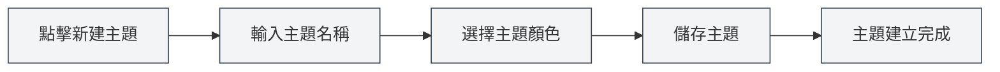

# 自訂主題管理

## 概述

自訂主題管理允許您建立、編輯、刪除和複製自訂主題。透過自訂主題，您可以打造符合個人喜好的介面外觀，提升使用體驗。

## 新建自訂主題

### 建立新主題

1.  在主題設定頁面，點擊「新建主題」卡片（+圖示）
2.  在彈出的對話框中：
    -   輸入主題名稱（可選，預設使用顏色值）
    -   選擇主題顏色（使用顏色選擇器）
3.  點擊「儲存」按鈕

您可以透過頂端選單列存取主題設定：

<MenuItemsDemo mode="demo" :items='[{"id": "settings"}]' />

### 主題顏色選擇

顏色選擇器提供以下功能：

-   **顏色選擇**：點擊顏色區域選擇顏色
-   **預設顏色**：從預設顏色清單中選擇
-   **透明度調整**：調整顏色的透明度（Alpha通道）
-   **顏色值輸入**：直接輸入HEX顏色值

### 主題命名

-   **自動命名**：如果不輸入名稱，系統會使用顏色值作為名稱
-   **自訂名稱**：輸入有意義的名稱，便於識別和管理
-   **命名建議**：使用描述性的名稱，如「工作主題」、「夜間模式」等

<SettingThemeSection mode="demo" />

## 編輯自訂主題

### 修改主題

1.  在主題清單中，找到要編輯的自訂主題
2.  點擊主題卡片上的「更多」按鈕（三個點圖示）
3.  選擇「編輯」
4.  在對話框中修改主題名稱或顏色
5.  點擊「儲存」按鈕

<DialogDemo mode="demo" dialogType="theme-edit" />

### 快速編輯顏色

您也可以直接在主題卡片上編輯顏色：

1.  點擊主題卡片上的顏色選擇器
2.  選擇新顏色
3.  顏色會立即套用

**注意事項**：

-   預設主題不能編輯
-   只有自訂主題可以編輯
-   編輯後需要儲存才能永久生效

## 刪除自訂主題

### 刪除主題

1.  在主題清單中，找到要刪除的自訂主題
2.  點擊主題卡片上的「更多」按鈕
3.  選擇「刪除」
4.  確認刪除操作

**注意事項**：

-   刪除操作不可恢復
-   如果刪除的是目前使用的主題，系統會自動切換到預設主題
-   預設主題不能刪除

## 複製主題

### 複製現有主題

1.  在主題清單中，找到要複製的主題
2.  點擊主題卡片上的「更多」按鈕
3.  選擇「複製」
4.  系統會建立一個副本，名稱後新增「副本」
5.  可以編輯副本建立新主題

### 使用場景

-   **基於現有主題建立新主題**：複製後修改顏色
-   **建立主題變體**：建立相似但略有不同的主題
-   **備份主題**：複製作為備份

## 主題顏色設定

### 顏色選擇器功能

顏色選擇器提供豐富的顏色選擇功能：

-   **顏色面板**：點擊選擇顏色
-   **預設顏色**：快速選擇常用顏色
-   **顏色值輸入**：直接輸入HEX、RGB、HSL等格式
-   **透明度調整**：調整顏色的透明度

<DialogDemo mode="demo" dialogType="color-picker" />

### 預設顏色

MetaDoc提供了多種預設顏色：

-   **基礎色**：紅、橙、黃、綠、青、藍、紫、灰
-   **淺色系**：淺紅、淺橙、淺黃等
-   **深色系**：深紅、深橙、深黃等

### 顏色格式

支援的顏色格式：

-   **HEX**：`#FF5733`（最常用）
-   **RGB**：`rgb(255, 87, 51)`
-   **HSL**：`hsl(9, 100%, 60%)`

## 主題應用

### 套用自訂主題

1.  在主題清單中，點擊要使用的自訂主題卡片
2.  主題會立即套用
3.  介面顏色會根據主題色自動產生

### 主題色影響

主題色會影響以下介面元素：

-   **背景色**：主背景和次背景
-   **文字色**：主要文字和次要文字
-   **側邊欄**：側邊欄背景和文字
-   **編輯器**：編輯器背景和工具列
-   **其他元素**：按鈕、邊框、高亮等

### 自動配色

MetaDoc會根據主題色自動產生配色方案：

-   **淺色主題**：主題色較亮時，產生淺色配色
-   **深色主題**：主題色較暗時，產生深色配色
-   **配色演算法**：使用顏色混合和飽和度調整

## 主題管理

### 主題清單

主題設定頁面顯示所有可用主題：

-   **預設主題**：系統內建的主題
-   **自訂主題**：使用者建立的主題
-   **目前主題**：顯示選中標記

### 主題排序

主題按以下順序顯示：

1.  系統同步主題（跟隨系統）
2.  淺色/深色預設主題
3.  自訂主題（按建立時間）

### 主題狀態

每個主題卡片顯示：

-   **主題色預覽**：顯示主題的主要顏色
-   **主題名稱**：顯示主題的名稱
-   **顏色值**：顯示顏色的HEX值
-   **選中標記**：目前使用的主題

## 最佳實踐

1.  **主題命名**：使用有意義的名稱，便於識別
2.  **顏色選擇**：選擇護眼的顏色，避免過於鮮豔
3.  **主題備份**：重要主題建議複製備份
4.  **定期清理**：刪除不再使用的主題，保持清單整潔
5.  **測試效果**：建立主題後測試實際效果，根據使用體驗調整

## 注意事項

1.  **預設主題**：預設主題不能編輯或刪除
2.  **主題相容性**：某些主題可能在不同環境下顯示效果不同
3.  **顏色選擇**：建議選擇對比度適中的顏色，保證可讀性
4.  **主題數量**：建議不要建立過多主題，保持清單簡潔
5.  **主題同步**：主題變更會在所有視窗間同步

## 相關文件

-   [[settings.theme|主題配置]]
-   [[settings.basic|基礎設定]]
-   [[core.editor-settings|編輯器設定]]

<ResizableDivider mode="demo" />

<SettingThemeSection mode="demo" />

<MenuItemsDemo mode="demo" :items='[{"id": "settings", "items": ["theme"]}]' />

<DialogDemo mode="demo" dialogType="color-picker" />

<DialogDemo mode="demo" dialogType="theme-edit" />

<MenuItemsDemo mode="demo" :items='[{"id": "settings"}]' />
