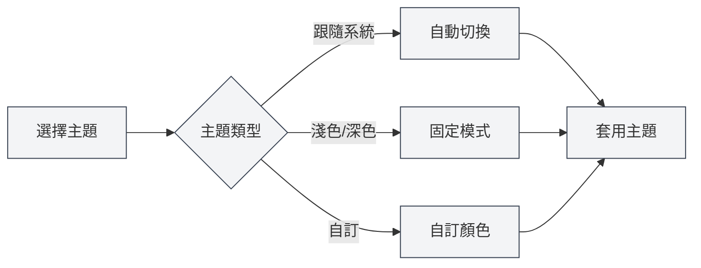

# 主題配置

## 概述

主題配置允許您自訂 MetaDoc 的外觀，包括全域主題、內容主題、程式碼主題等。合理配置主題可以提升使用體驗，減少視覺疲勞。

## 全域主題

### 主題類型

MetaDoc 支援以下全域主題類型：

- **跟隨系統深淺**：自動跟隨作業系統的淺色/深色模式
- **跟隨系統顏色**：跟隨作業系統的主題色（Windows 11）
- **淺色**：固定使用淺色主題
- **深色**：固定使用深色主題
- **自訂**：使用自訂主題顏色

### 選擇主題

1.  在主題設定頁面，瀏覽主題卡片
2.  點擊想要使用的主題卡片
3.  主題會立即套用

您可以透過頂端選單列存取主題設定：

<MenuItemsDemo mode="demo" :items='[{"id": "settings"}]' />

### 淺色主題預覽

<SettingThemeSection mode="demo" theme="light" />

### 深色主題預覽

<SettingThemeSection mode="demo" theme="dark" />

### 主題設定介面

下圖展示了主題設定頁面的完整介面：

<SettingThemeSection mode="demo" />

<ViewMenuItemsDemo mode="demo" :items='["editor", "outline"]' />

主題設定介面包含以下主要功能區域：

- **全域主題**：選擇淺色、深色、跟隨系統或自訂主題
- **內容主題**：設定編輯器區域的顯示主題
- **程式碼主題**：選擇程式碼區塊的語法高亮主題
- **行號顯示**：控制程式碼區塊是否顯示行號
- **自訂主題**：建立和管理自訂顏色主題

### 主題預覽

每個主題卡片都會顯示：

- **主題色預覽**：顯示主題的主要顏色
- **主題名稱**：顯示主題的名稱
- **選中標記**：目前使用的主題會顯示選中標記

## 內容主題

<SettingThemeSection mode="demo" />

### 設定內容主題

內容主題控制文件編輯區域的顯示主題：

- **自動**：跟隨全域主題
- **淺色**：固定使用淺色內容主題
- **深色**：固定使用深色內容主題

### 使用場景

- **全域深色，內容淺色**：適合在暗環境中編輯淺色文件
- **全域淺色，內容深色**：適合在亮環境中編輯深色文件
- **自動模式**：內容主題自動跟隨全域主題

## 程式碼主題

<SettingThemeSection mode="demo" />

### 設定程式碼主題

程式碼主題控制程式碼區塊的語法高亮主題：

- **自動**：跟隨全域主題自動選擇
- **自訂**：從程式碼主題清單中選擇

### 程式碼主題清單

MetaDoc 支援多種程式碼主題，包括：

- **淺色主題**：GitHub、VS、OneLight 等
- **深色主題**：Monokai、Dracula、OneDark 等

### 選擇建議

- **淺色文件**：使用淺色程式碼主題
- **深色文件**：使用深色程式碼主題
- **自動模式**：讓系統自動選擇，保持一致性

## 行號顯示

<SettingThemeSection mode="demo" />

### 顯示行號

啟用「程式碼框顯示行號」後，程式碼區塊會顯示行號：

- **啟用**：程式碼區塊左側顯示行號
- **停用**：不顯示行號

### 使用場景

- **程式碼除錯**：行號有助於定位程式碼位置
- **程式碼分享**：行號便於引用特定行
- **程式碼閱讀**：行號有助於理解程式碼結構

## 主題切換

<SettingThemeSection mode="demo" />

<ViewMenuItemsDemo mode="demo" :items='["editor", "outline"]' />

### 即時切換

主題切換會立即生效：

1.  選擇新主題
2.  介面立即更新
3.  所有視窗同步套用

### 主題同步

- **多視窗同步**：所有視窗會自動同步主題
- **設定儲存**：主題選擇會自動儲存
- **下次啟動**：下次啟動時會使用上次選擇的主題

## 預設主題

<SettingThemeSection mode="demo" />

### 內建主題

MetaDoc 提供了多種預設主題：

- **淺色主題**：適合明亮環境
- **深色主題**：適合暗環境
- **系統同步**：自動跟隨系統設定

### 預設主題特點

- **優化配色**：經過精心設計的配色方案
- **護眼設計**：減少視覺疲勞
- **一致性**：保證介面元素的一致性

## 最佳實踐

1.  **環境適應**：根據使用環境選擇主題
2.  **內容匹配**：內容主題與文件類型匹配
3.  **程式碼可讀性**：選擇程式碼可讀性高的程式碼主題
4.  **定期調整**：根據使用體驗調整主題設定

## 注意事項

1.  **系統相容性**：跟隨系統主題需要作業系統支援
2.  **主題一致性**：建議保持全域主題和內容主題的一致性
3.  **程式碼主題**：程式碼主題會影響程式碼的可讀性
4.  **自訂主題**：自訂主題需要手動建立和管理

## 相關文件

- [[settings.theme-custom|自訂主題管理]]
- [[settings.basic|基礎設定]]
- [[core.editor-settings|編輯器設定]]