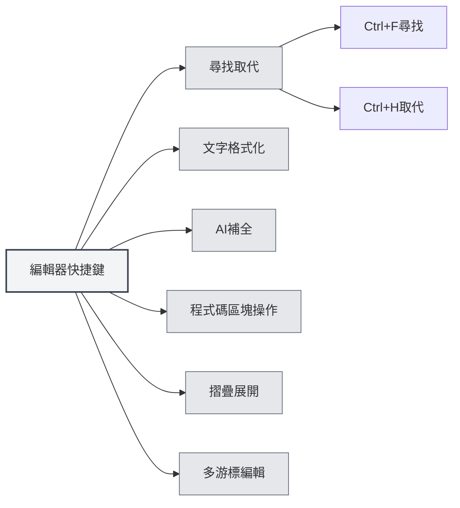

# 編輯器快捷鍵

## 概述

編輯器快捷鍵是在編輯器介面中使用的快捷鍵，包括文字編輯、尋找取代、格式化等功能。熟練掌握這些快捷鍵可以提升編輯效率。

<MenuItemsDemo mode="demo" :items='[{"id": "edit"}]' />

<ViewMenuItemsDemo mode="demo" :items='["editor", "outline"]' />

**說明**：尋找/取代（Ctrl+F、Ctrl+H）由應用全域實現；粗體/斜體/連結/程式碼區塊等由底層編輯器（Markdown 使用 Vditor，LaTeX 使用 Monaco）提供，若無效請以實際編輯器行為為準。

## 尋找取代

### 尋找

- **快捷鍵**：`Ctrl+F`（Windows/Linux）或 `Cmd+F`（macOS）
- **功能**：開啟尋找對話方塊
- **使用場景**：在文件中尋找特定文字

### 尋找取代

- **快捷鍵**：`Ctrl+H`（Windows/Linux）或 `Cmd+H`（macOS）
- **功能**：開啟尋找取代對話方塊
- **使用場景**：尋找並取代文字

### 尋找功能

尋找對話方塊支援以下功能：

- **尋找文字**：輸入要尋找的文字
- **取代文字**：輸入取代後的文字
- **正規表示式**：支援正規表示式搜尋
- **大小寫匹配**：區分大小寫
- **全字匹配**：匹配完整單字

尋找取代選單介面如下：

<SearchReplaceMenu mode="demo" :position='{"top": 100, "left": 200}' :adapter='null' />

<SearchReplaceMenu mode="demo" :position='{"top": 150, "left": 200}' :adapter='null' />

## 文字格式化

<TextFormatToolbar mode="demo" />

### 粗體

- **快捷鍵**：`Ctrl+B`（Windows/Linux）或 `Cmd+B`（macOS）
- **功能**：將選中文字設為粗體
- **使用場景**：強調重要內容

### 斜體

- **快捷鍵**：`Ctrl+I`（Windows/Linux）或 `Cmd+I`（macOS）
- **功能**：將選中文字設為斜體
- **使用場景**：表示引用或強調

### 插入連結

- **快捷鍵**：`Ctrl+K`（Windows/Linux）或 `Cmd+K`（macOS）
- **功能**：插入連結
- **使用場景**：新增超連結

**注意事項**：此快捷鍵可能與儲存全部（Ctrl+K S）衝突，需要先按Ctrl+K，然後按K，而不是同時按。

## AI補全

<AISuggestionGhost mode="demo" />

<CompletionSettingsPanel mode="demo" />

### 手動觸發補全

- **快捷鍵**：`Shift+Tab`
- **功能**：手動觸發AI自動補全
- **使用場景**：需要AI補全時手動觸發

### 補全觸發按鍵

AI補全還可以透過以下按鍵自動觸發：

- **Enter**：按Enter鍵觸發
- **Space**：按空白鍵觸發
- **分號**：按分號（;）觸發
- **斜線**：按斜線（/）觸發

這些觸發按鍵可以在[[settings.llm|LLM配置]]中設定。

## 程式碼區塊操作

### 插入程式碼區塊

- **快捷鍵**：`Ctrl+Shift+K`（Markdown編輯器）
- **功能**：插入程式碼區塊
- **使用場景**：新增程式碼範例

## 摺疊展開

### 摺疊程式碼區塊

- **快捷鍵**：`Ctrl+Shift+[`（Windows/Linux）或 `Cmd+Option+[`（macOS）
- **功能**：摺疊目前程式碼區塊或環境
- **使用場景**：隱藏不需要檢視的程式碼

### 展開程式碼區塊

- **快捷鍵**：`Ctrl+Shift+]`（Windows/Linux）或 `Cmd+Option+]`（macOS）
- **功能**：展開摺疊的程式碼區塊或環境
- **使用場景**：檢視摺疊的內容

## 多游標編輯

### 選中所有相同單字

- **快捷鍵**：`Ctrl+Shift+L`（Windows/Linux）或 `Cmd+Shift+L`（macOS）
- **功能**：選中文件中所有相同的單字並新增游標
- **使用場景**：批次編輯相同的文字

## 復原和重做

### 復原

- **快捷鍵**：`Ctrl+Z`（Windows/Linux）或 `Cmd+Z`（macOS）
- **功能**：復原上一步操作
- **使用場景**：復原誤操作

### 重做

- **快捷鍵**：`Ctrl+Y` 或 `Ctrl+Shift+Z`（Windows/Linux）或 `Cmd+Shift+Z`（macOS）
- **功能**：重做被復原的操作
- **使用場景**：恢復復原的操作

## 選擇操作

### 全選

- **快捷鍵**：`Ctrl+A`（Windows/Linux）或 `Cmd+A`（macOS）
- **功能**：選中所有文字
- **使用場景**：選擇全部內容進行複製或刪除

### 複製

- **快捷鍵**：`Ctrl+C`（Windows/Linux）或 `Cmd+C`（macOS）
- **功能**：複製選中文字
- **使用場景**：複製內容到剪貼簿

### 貼上

- **快捷鍵**：`Ctrl+V`（Windows/Linux）或 `Cmd+V`（macOS）
- **功能**：貼上剪貼簿內容
- **使用場景**：貼上複製的內容

### 剪下

- **快捷鍵**：`Ctrl+X`（Windows/Linux）或 `Cmd+X`（macOS）
- **功能**：剪下選中文字
- **使用場景**：移動文字內容

## 編輯器快捷鍵列表

### Windows/Linux快捷鍵

| 功能             | 快捷鍵                     |
| ---------------- | -------------------------- |
| 尋找             | `Ctrl+F`                   |
| 尋找取代         | `Ctrl+H`                   |
| 粗體             | `Ctrl+B`                   |
| 斜體             | `Ctrl+I`                   |
| 插入連結         | `Ctrl+K`                   |
| 插入程式碼區塊   | `Ctrl+Shift+K`             |
| 摺疊             | `Ctrl+Shift+[`             |
| 展開             | `Ctrl+Shift+]`             |
| 選中所有相同單字 | `Ctrl+Shift+L`             |
| 復原             | `Ctrl+Z`                   |
| 重做             | `Ctrl+Y` 或 `Ctrl+Shift+Z` |
| 全選             | `Ctrl+A`                   |
| 複製             | `Ctrl+C`                   |
| 貼上             | `Ctrl+V`                   |
| 剪下             | `Ctrl+X`                   |
| AI補全           | `Shift+Tab`                |

### macOS快捷鍵

| 功能             | 快捷鍵         |
| ---------------- | -------------- |
| 尋找             | `Cmd+F`        |
| 尋找取代         | `Cmd+H`        |
| 粗體             | `Cmd+B`        |
| 斜體             | `Cmd+I`        |
| 插入連結         | `Cmd+K`        |
| 插入程式碼區塊   | `Cmd+Shift+K`  |
| 摺疊             | `Cmd+Option+[` |
| 展開             | `Cmd+Option+]` |
| 選中所有相同單字 | `Cmd+Shift+L`  |
| 復原             | `Cmd+Z`        |
| 重做             | `Cmd+Shift+Z`  |
| 全選             | `Cmd+A`        |
| 複製             | `Cmd+C`        |
| 貼上             | `Cmd+V`        |
| 剪下             | `Cmd+X`        |
| AI補全           | `Shift+Tab`    |

## Markdown編輯器特有快捷鍵

<LaTeXEditorDemo mode="demo" />

### Vditor快捷鍵

Markdown編輯器基於Vditor，支援以下快捷鍵：

- **粗體**：`Ctrl+B`
- **斜體**：`Ctrl+I`
- **插入連結**：`Ctrl+K`
- **插入程式碼區塊**：`Ctrl+Shift+K`

## LaTeX編輯器特有快捷鍵

<LaTeXEditorDemo mode="demo" />

### Monaco編輯器快捷鍵

LaTeX編輯器基於Monaco Editor，支援以下快捷鍵：

- **摺疊**：`Ctrl+Shift+[`
- **展開**：`Ctrl+Shift+]`
- **選中所有相同單字**：`Ctrl+Shift+L`
- **多游標編輯**：`Alt+Click` 新增游標

## 快捷鍵使用技巧

<LaTeXEditorDemo mode="demo" />

<Outline mode="demo" />

### 組合使用

可以組合使用多個快捷鍵：

1. **尋找並取代**：`Ctrl+H` 開啟尋找取代，然後使用Tab鍵切換輸入框
2. **格式化文字**：選中文字後使用 `Ctrl+B` 或 `Ctrl+I` 格式化
3. **批次編輯**：使用 `Ctrl+Shift+L` 選中所有相同單字，然後統一編輯

### 快捷鍵記憶

- **格式化**：B（Bold）、I（Italic）對應粗體和斜體
- **尋找**：F（Find）、H（Hunt/尋找取代）
- **摺疊**：`[` 和 `]` 對應摺疊和展開

## 最佳實踐

<MainTabs mode="demo" />

1. **熟練使用**：熟練掌握常用編輯快捷鍵
2. **組合操作**：結合多個快捷鍵完成複雜編輯
3. **批次編輯**：使用多游標功能批次編輯
4. **快速格式化**：使用快捷鍵快速格式化文字
5. **尋找取代**：使用尋找取代功能提高效率

## 注意事項

1. **平台差異**：Windows/Linux使用Ctrl，macOS使用Cmd
2. **快捷鍵衝突**：某些快捷鍵可能與編輯器功能衝突
3. **上下文相關**：某些快捷鍵只在特定上下文中有效
4. **編輯器差異**：Markdown和LaTeX編輯器支援的快捷鍵可能不同
5. **AI補全**：Shift+Tab是手動觸發，自動觸發需要配置觸發按鍵

## 相關文件

- [[shortcuts.global|全域快捷鍵]]
- [[core.editor-basics|編輯器基礎操作]]
- [[markdown.features|Markdown編輯器功能]]
- [[ai.completion|AI自動補全]]

<MenuItemsDemo mode="demo" :items='[{"id": "file"}]' />

<ViewMenuItemsDemo mode="demo" :items='["editor"]' />

<AISuggestionGhost mode="demo" />

<CompletionSettingsPanel mode="demo" />

<LaTeXEditorDemo mode="demo" />