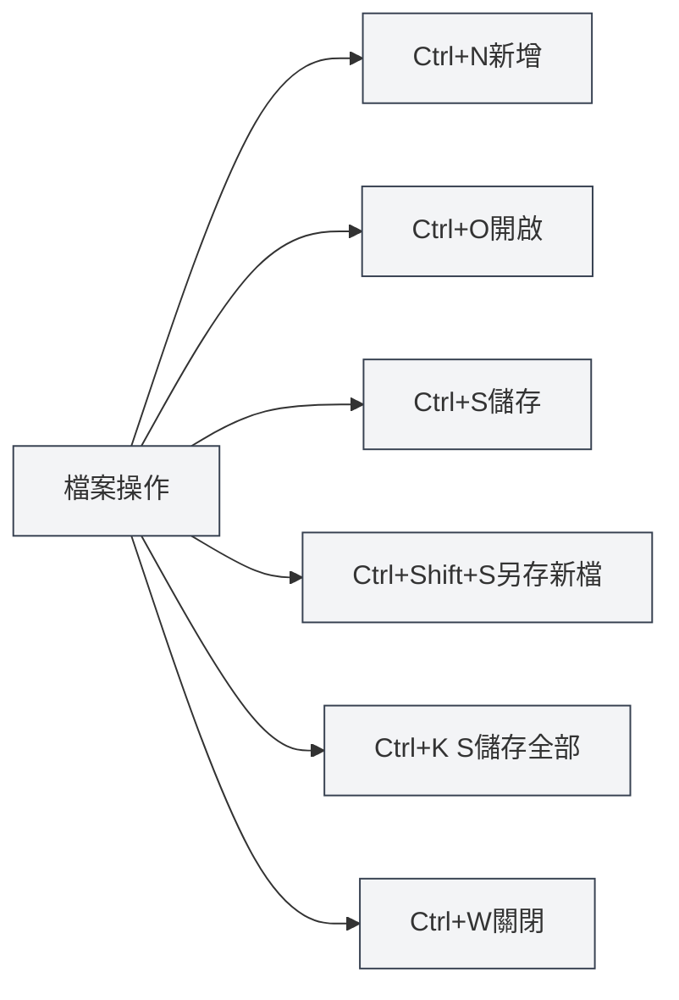

# 全域快捷鍵

## 概述

全域快捷鍵是MetaDoc中可以在任何介面使用的快捷鍵。熟練掌握這些快捷鍵可以顯著提升工作效率。

**說明**：本文檔中的快捷鍵已與當前程式碼實現核對，均在主進程或渲染進程中實現並可用。

## 檔案操作

### 新增文件

- **快捷鍵**：`Ctrl+N`（Windows/Linux）或 `Cmd+N`（macOS）
- **功能**：建立新的空白文件
- **使用場景**：快速開始新的文件編輯

### 開啟文件

- **快捷鍵**：`Ctrl+O`（Windows/Linux）或 `Cmd+O`（macOS）
- **功能**：開啟檔案選擇對話框
- **使用場景**：開啟已有文件

### 儲存文件

- **快捷鍵**：`Ctrl+S`（Windows/Linux）或 `Cmd+S`（macOS）
- **功能**：儲存目前文件
- **使用場景**：儲存編輯內容，防止遺失

### 另存新檔

- **快捷鍵**：`Ctrl+Shift+S`（Windows/Linux）或 `Cmd+Shift+S`（macOS）
- **功能**：將目前文件儲存為新檔案
- **使用場景**：建立文件副本或變更儲存位置

### 儲存全部文件

- **快捷鍵**：`Ctrl+K S`（Windows/Linux）或 `Cmd+K S`（macOS）
- **功能**：儲存所有開啟的文件
- **使用說明**：先按 `Ctrl+K`（或 `Cmd+K`），然後按 `S`
- **使用場景**：一次性儲存所有文件

<MenuItemsDemo mode="demo" :items='[{"id": "file", "items": ["save-all"]}]' />

### 關閉檔案

- **快捷鍵**：`Ctrl+W`（Windows/Linux）或 `Cmd+W`（macOS）
- **功能**：關閉目前分頁
- **使用場景**：關閉不需要的文件

## 分頁操作

分頁欄顯示所有開啟的文件，支援新增、切換、關閉等操作：

<MainTabs mode="demo" />

<ViewMenuItemsDemo mode="demo" :items='["editor", "outline"]' />

### 新增分頁

- **快捷鍵**：`Ctrl+T`（Windows/Linux）或 `Cmd+T`（macOS）
- **功能**：建立新的分頁
- **使用場景**：快速建立新文件

### 切換分頁

#### 下一個分頁

- **快捷鍵**：`Ctrl+Tab`（Windows/Linux）或 `Cmd+Tab`（macOS）
- **功能**：切換到下一個分頁
- **使用說明**：按住 `Ctrl+Tab` 會顯示分頁切換浮層，可以繼續按Tab鍵選擇或直接點擊
- **使用場景**：快速在多個文件間切換

<TabSwitcherOverlay mode="demo" />

#### 上一個分頁

- **快捷鍵**：`Ctrl+Shift+Tab`（Windows/Linux）或 `Cmd+Shift+Tab`（macOS）
- **功能**：切換到上一個分頁
- **使用場景**：反向切換分頁

### 重新開啟已關閉的分頁

- **快捷鍵**：`Ctrl+Shift+T`（Windows/Linux）或 `Cmd+Shift+T`（macOS）
- **功能**：重新開啟最近關閉的分頁
- **使用說明**：可以連續使用，依序恢復最近關閉的分頁（最多恢復20個）
- **使用場景**：誤關閉分頁後快速恢復

<MainTabs mode="demo" />

## 其他快捷鍵

### 開啟使用者手冊

- **快捷鍵**：`F1`
- **功能**：開啟使用者手冊頁面
- **使用場景**：需要檢視說明文件時

<MenuItemsDemo mode="demo" :items='[{"id": "help"}]' />

## 快捷鍵列表

### Windows/Linux快捷鍵

| 功能           | 快捷鍵           |
| -------------- | ---------------- |
| 新增文件       | `Ctrl+N`         |
| 開啟文件       | `Ctrl+O`         |
| 儲存文件       | `Ctrl+S`         |
| 另存新檔       | `Ctrl+Shift+S`   |
| 儲存全部       | `Ctrl+K S`       |
| 關閉分頁       | `Ctrl+W`         |
| 新增分頁       | `Ctrl+T`         |
| 下一個分頁     | `Ctrl+Tab`       |
| 上一個分頁     | `Ctrl+Shift+Tab` |
| 重新開啟已關閉 | `Ctrl+Shift+T`   |
| 開啟使用者手冊 | `F1`             |

### macOS快捷鍵

| 功能           | 快捷鍵          |
| -------------- | --------------- |
| 新增文件       | `Cmd+N`         |
| 開啟文件       | `Cmd+O`         |
| 儲存文件       | `Cmd+S`         |
| 另存新檔       | `Cmd+Shift+S`   |
| 儲存全部       | `Cmd+K S`       |
| 關閉分頁       | `Cmd+W`         |
| 新增分頁       | `Cmd+T`         |
| 下一個分頁     | `Cmd+Tab`       |
| 上一個分頁     | `Cmd+Shift+Tab` |
| 重新開啟已關閉 | `Cmd+Shift+T`   |
| 開啟使用者手冊 | `F1`            |

## 快捷鍵使用技巧

### 組合鍵順序

某些快捷鍵需要按順序按下：

- **儲存全部**：先按 `Ctrl+K`，然後按 `S`（不是同時按）
- **分頁切換**：按住 `Ctrl+Tab` 顯示浮層，然後繼續按Tab選擇

### 自訂快捷鍵

您可以在 **設定 → 快捷鍵** 中管理全域快捷鍵：

- **按鍵方案**：程式提供 Windows、Linux、macOS 三套預設方案，首次啟動會根據目前系統自動選擇
- **新增/編輯方案**：可建立自訂方案並修改各動作的按鍵
- **匯入/匯出**：支援將方案匯出為 JSON 檔案，或從檔案匯入方案
- **恢復預設**：每個按鍵項若與預設方案不同，可點擊「恢復預設」還原

變更方案後需在底部點擊「儲存」才會生效。

### 快捷鍵衝突

如果快捷鍵與系統或其他軟體衝突：

- **系統快捷鍵**：某些系統快捷鍵可能優先
- **其他軟體**：關閉衝突的軟體或修改其快捷鍵
- **自訂快捷鍵**：在 **設定 → 快捷鍵** 中可修改為其他按鍵

### 記憶技巧

- **檔案操作**：使用標準的檔案操作快捷鍵（Ctrl+N/O/S）
- **分頁操作**：使用Tab鍵相關組合
- **儲存全部**：使用Ctrl+K作為命令前綴

## 最佳實踐

1. **熟練使用**：熟練掌握常用快捷鍵，提升效率
2. **組合使用**：結合多個快捷鍵完成複雜操作
3. **分頁切換**：使用Ctrl+Tab快速切換，避免滑鼠操作
4. **定期儲存**：養成使用Ctrl+S定期儲存的習慣
5. **快速恢復**：誤關閉分頁時使用Ctrl+Shift+T快速恢復

## 注意事項

1. **平台差異**：Windows/Linux使用Ctrl，macOS使用Cmd
2. **快捷鍵衝突**：注意與其他軟體的快捷鍵衝突
3. **組合鍵順序**：某些快捷鍵需要按順序按下
4. **分頁切換**：Ctrl+Tab會顯示浮層，可以繼續選擇
5. **儲存全部**：Ctrl+K S需要先按Ctrl+K，再按S

## 相關文件

- [[shortcuts.editor|編輯器快捷鍵]]
- [[core.file-operations|檔案操作]]
- [[core.multi-tab|多分頁管理]]

<MenuItemsDemo mode="demo" :items='[{"id": "file"}]' />

<MainTabs mode="demo" />

<ViewMenuItemsDemo mode="demo" :items='["editor", "outline", "agent"]' />

<QuickStartPanel mode="demo" />