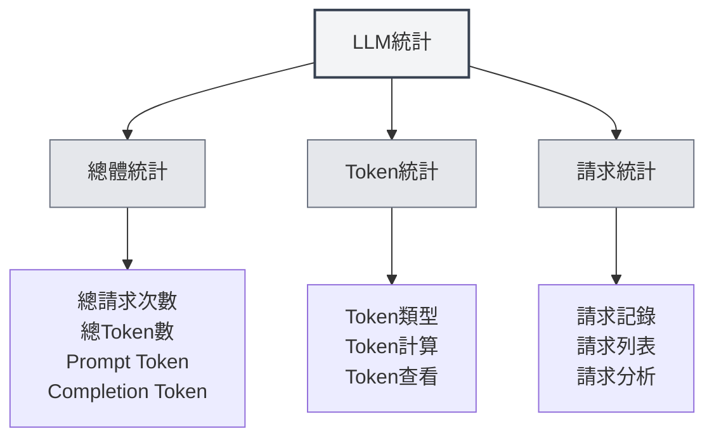

# LLM統計

## 概述

LLM統計功能用於追蹤和查看LLM API的使用情況，包括Token使用量、請求次數、成本統計等資訊。這些統計數據可以幫助您了解LLM的使用情況，優化使用策略。

## 開啟LLM統計

### 存取方式

可以透過以下方式開啟LLM統計頁面：

- **設定頁面**：在設定頁面中可能有LLM統計入口
- **選單選項**：某些選單中可能有LLM統計選項
- **快速鍵**：某些情況下可能有快速鍵（未來可能支援）

<SettingLlmSection mode="demo" />

## 統計資訊

<LlmStatisticsView mode="demo" />

<LlmStatisticsContent mode="demo" />

### 總體統計

LLM統計頁面顯示以下總體統計資訊：

- **總請求次數**：所有LLM請求的總次數
- **總Token數**：所有請求使用的總Token數
- **Prompt Token**：所有請求的Prompt Token總數
- **Completion Token**：所有請求的Completion Token總數

### 時間範圍篩選

可以按時間範圍篩選統計數據：

- **全部時間**：查看所有時間的統計數據
- **今天**：查看今天的統計數據
- **本週**：查看本週的統計數據
- **本月**：查看本月的統計數據
- **自訂範圍**：選擇自訂的開始和結束日期

### 統計圖表

<ChartGenerationDisplay mode="demo" />

統計頁面可能包含以下圖表：

- **Token使用趨勢**：顯示Token使用量隨時間的變化趨勢
- **請求次數趨勢**：顯示請求次數隨時間的變化趨勢
- **模型使用分佈**：顯示不同模型的使用情況
- **請求類型分佈**：顯示不同類型請求的分佈情況

## Token統計

<DataAnalysisDisplay mode="demo" />

### Token類型

Token統計包括以下類型：

- **Prompt Token**：輸入提示的Token數
- **Completion Token**：生成內容的Token數
- **Total Token**：總Token數（Prompt + Completion）

### Token計算

Token計算方式：

- **自動記錄**：每次LLM請求後自動記錄Token使用量
- **即時更新**：統計數據即時更新
- **累計統計**：統計數據累計計算

### Token查看

可以查看以下Token資訊：

- **總Token數**：所有請求的總Token數
- **平均Token數**：每次請求的平均Token數
- **最大Token數**：單次請求的最大Token數
- **最小Token數**：單次請求的最小Token數

## 請求統計

<LlmStatisticsContent mode="demo" />

### 請求記錄

每次LLM請求都會記錄以下資訊：

- **時間戳**：請求的時間
- **模型名稱**：使用的模型名稱
- **請求類型**：請求類型（chat/completion）
- **Token使用量**：本次請求的Token使用量

### 請求列表

可以查看請求列表：

- **時間排序**：按時間倒序排列
- **詳細資訊**：查看每次請求的詳細資訊
- **篩選功能**：按模型、類型等篩選請求

### 請求分析

可以對請求進行分析：

- **請求頻率**：分析請求的頻率
- **模型使用**：分析不同模型的使用情況
- **類型分佈**：分析不同類型請求的分佈

## 成本統計

<LlmStatisticsView mode="demo" />

### 成本計算

成本統計基於以下資訊：

- **Token使用量**：根據Token使用量計算成本
- **模型定價**：不同模型有不同的定價
- **成本估算**：提供成本估算（如果支援）

### 成本查看

可以查看以下成本資訊：

- **總成本**：所有請求的總成本
- **日均成本**：平均每天的成本
- **模型成本**：不同模型的成本分佈
- **成本趨勢**：成本隨時間的變化趨勢

**注意事項**：成本統計僅供參考，實際成本以API供應商的帳單為準。

## 資料匯出

<DataAnalysisDisplay mode="demo" />

### 匯出功能

可以匯出統計數據：

- **匯出格式**：可能支援多種格式（JSON、CSV等）
- **匯出範圍**：可以選擇匯出全部或篩選後的資料
- **匯出內容**：可以選擇匯出哪些統計資訊

### 資料備份

統計數據會自動儲存：

- **本地儲存**：統計數據儲存在本地
- **自動儲存**：每次請求後自動儲存
- **資料持久化**：應用重啟後資料仍然保留

## 清空統計

### 清空操作

可以清空統計數據：

1. 開啟LLM統計頁面
2. 找到清空統計按鈕
3. 確認清空操作
4. 統計數據會被清空

**注意事項**：

- 清空操作不可恢復
- 清空前建議先匯出資料備份
- 清空後所有統計數據會遺失

## 統計設定

### 統計開關

可以控制統計功能：

- **啟用統計**：啟用LLM使用統計
- **停用統計**：停用統計功能（不記錄資料）

### 統計精度

可以設定統計精度：

- **詳細記錄**：記錄每次請求的詳細資訊
- **簡化記錄**：只記錄總體統計資訊

## 最佳實踐

1. **定期查看**：定期查看LLM使用統計，了解使用情況
2. **成本控制**：根據成本統計控制使用量
3. **優化策略**：根據統計數據優化使用策略
4. **資料備份**：定期匯出統計數據備份
5. **合理使用**：根據統計資訊合理使用LLM功能

## 注意事項

1. **統計準確性**：統計數據基於API返回的Token資訊
2. **成本估算**：成本統計僅供參考，實際成本以帳單為準
3. **資料儲存**：統計數據儲存在本地，不會上傳
4. **隱私保護**：統計數據不包含具體內容，只包含使用量資訊
5. **效能影響**：統計功能對效能影響很小，可以放心使用

## 相關文件

- [[settings.llm|LLM配置]]
- [[ai.chat|AI對話功能]]
- [[ai.completion|AI自動補全]]

<LlmStatisticsView mode="demo" />

<LlmStatisticsContent mode="demo" />
