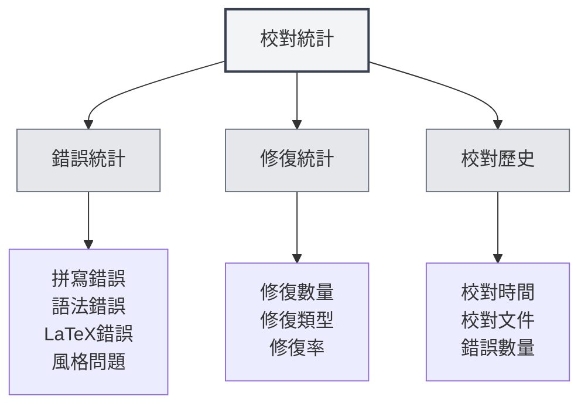

# 校對工具統計

## 概述

校對工具統計功能用於追蹤和查看文件校對的使用情況，包括拼寫檢查、語法檢查等統計資訊。這些統計數據可以幫助您了解校對功能的使用情況，優化校對策略。

<ProofreadView mode="demo" />

<ProofreadDisplay mode="demo" />

<DataAnalysisDisplay mode="demo" />

## 校對統計介紹

### 什麼是校對統計

校對統計記錄文件校對過程中的相關資訊：

- **錯誤統計**：記錄檢測到的錯誤數量和類型
- **修復統計**：記錄修復的錯誤數量
- **校對歷史**：記錄校對操作的歷史

### 統計類型

校對統計包括以下類型：

- **拼寫錯誤**：拼寫檢查發現的錯誤
- **語法錯誤**：語法檢查發現的錯誤
- **LaTeX錯誤**：LaTeX語法檢查發現的錯誤
- **風格問題**：風格檢查發現的問題
- **其他錯誤**：其他類型的錯誤

## 錯誤統計

<DataAnalysisDisplay mode="demo" />

<ChartGenerationDisplay mode="demo" />

### 錯誤分類

校對工具會將錯誤分類統計：

- **拼寫錯誤**：單字拼寫錯誤的數量
- **語法錯誤**：語法錯誤的數量
- **LaTeX錯誤**：LaTeX語法錯誤的數量
- **風格問題**：寫作風格問題的數量
- **其他錯誤**：其他類型錯誤的數量

### 錯誤計數

每次校對會統計錯誤：

- **總錯誤數**：所有錯誤的總數
- **各類錯誤數**：各類錯誤的數量
- **錯誤分佈**：錯誤類型的分佈情況

## 修復統計

### 修復記錄

記錄錯誤修復的情況：

- **修復數量**：已修復的錯誤數量
- **修復類型**：修復的錯誤類型
- **修復率**：修復錯誤的比例

### 修復歷史

可以查看修復歷史：

- **修復時間**：錯誤修復的時間
- **修復內容**：修復的具體內容
- **修復方式**：修復的方式（手動/自動）

## 校對歷史

### 歷史記錄

記錄校對操作的歷史：

- **校對時間**：校對操作的時間
- **校對文件**：被校對的文件
- **錯誤數量**：發現的錯誤數量
- **修復數量**：修復的錯誤數量

### 歷史查看

可以查看校對歷史：

- **歷史列表**：顯示所有校對歷史記錄
- **詳細資訊**：查看每次校對的詳細資訊
- **統計分析**：對歷史數據進行統計分析

## 統計視圖

<ProofreadView mode="demo" />

### 統一視圖

統一視圖顯示所有錯誤：

- **錯誤列表**：按順序顯示所有錯誤
- **錯誤詳情**：顯示每個錯誤的詳細資訊
- **錯誤定位**：可以定位到錯誤位置

<DataAnalysisDisplay mode="demo" />

### 分類視圖

分類視圖按類型顯示錯誤：

- **按類型分組**：錯誤按類型分組顯示
- **類型統計**：顯示每個類型的錯誤數量
- **類型篩選**：可以篩選特定類型的錯誤

## 統計匯出

### 匯出功能

可以匯出校對統計：

- **匯出格式**：可能支援多種格式（JSON、CSV等）
- **匯出範圍**：可以選擇匯出全部或篩選後的數據
- **匯出內容**：可以選擇匯出哪些統計資訊

<ChartGenerationDisplay mode="demo" />

## 最佳實踐

1. **定期校對**：定期使用校對功能檢查文件
2. **關注統計**：關注錯誤統計，了解文件品質
3. **及時修復**：發現錯誤及時修復
4. **分析趨勢**：分析錯誤趨勢，改進寫作習慣
5. **利用歷史**：利用歷史記錄，追蹤文件改進

## 注意事項

1. **統計準確性**：統計數據基於校對工具的檢測結果
2. **誤報處理**：某些檢測可能是誤報，需要人工判斷
3. **數據儲存**：統計數據儲存在本地，不會上傳
4. **隱私保護**：統計數據不包含具體內容，只包含統計資訊
5. **效能影響**：統計功能對效能影響很小，可以放心使用

## 相關文件

- [[ai.proofread|AI校對功能]]
- [[statistics.llm|LLM統計]]
