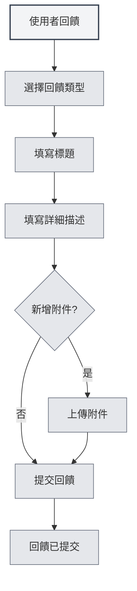

# 使用者回饋

## 概述

使用者回饋功能允許您向 MetaDoc 團隊提交問題報告、功能建議或其他回饋。您的回饋對我們改進產品非常重要。

## 開啟使用者回饋

### 存取方式

可以透過以下方式開啟使用者回饋頁面：

- **設定頁面**：在「關於」設定頁面中點擊「使用者回饋」按鈕
- **選單選項**：某些選單中可能有使用者回饋選項
- **快速鍵**：某些情況下可能有快速鍵（未來可能支援）

<SettingAboutSection mode="demo" />

## 回饋類型

### 回饋類型選擇

提交回饋時需要選擇回饋類型：

- **BUG 回饋**：報告軟體錯誤或問題
- **功能建議**：提出新功能或改進建議
- **安全性回饋**：報告安全性問題
- **其他**：其他類型的回饋

<DialogDemo mode="demo" dialogType="feedback" />

### 類型說明

- **BUG 回饋**：用於報告軟體錯誤、當機、異常行為等問題
- **功能建議**：用於提出新功能需求或現有功能的改進建議
- **安全性回饋**：用於報告安全漏洞或安全性問題
- **其他**：用於其他類型的回饋，如使用問題、文件問題等

## 回饋內容

### 標題

回饋標題應該：

- **簡潔明瞭**：簡要描述問題或建議
- **具體明確**：避免使用模糊的標題
- **必填項**：標題是必填項目

### 詳細描述

詳細描述應該包含：

- **問題描述**：清晰描述遇到的問題
- **期待結果**：說明期待的結果
- **其他資訊**：提供其他有助於診斷的資訊
- **聯絡方式**：可選的聯絡方式，方便後續跟進

### 回饋範本

系統會提供回饋範本，包含以下部分：

- **系統資訊**：自動填入系統資訊
- **問題描述**：描述問題的區域
- **期待結果**：期待結果的區域
- **其他資訊**：其他資訊的區域
- **聯絡方式**：可選的聯絡方式

<MenuItemsDemo mode="demo" :items='[{"id": "settings"}]' />

## 附件上傳

### 附件支援

可以上傳附件來輔助說明問題：

- **檔案類型**：支援任何類型的檔案
- **檔案大小**：單一檔案不超過 10MB
- **總大小**：所有附件總大小不超過 50MB
- **檔案數量**：最多上傳 5 個附件

<SettingImageSection mode="demo" />

### 附件用途

附件可以用於：

- **截圖**：提供問題截圖
- **日誌檔案**：提供錯誤日誌
- **範例檔案**：提供問題範例檔案
- **其他檔案**：提供其他相關檔案

### 附件規則

- **單一檔案限制**：單一檔案不超過 10MB
- **總大小限制**：所有附件總大小不超過 50MB
- **數量限制**：最多上傳 5 個附件
- **類型限制**：檔案類型不限，以 Gist 能力為準

## 提交回饋

### 提交步驟

1. **選擇類型**：選擇回饋類型
2. **填寫標題**：填寫回饋標題
3. **填寫描述**：填寫詳細描述
4. **新增附件**：可選，新增附件
5. **提交回饋**：點擊「提交回饋」按鈕

您可以透過設定頁面存取使用者回饋：

<MenuItemsDemo mode="demo" :items='[{"id": "settings"}]' />

<QuickStartPanel mode="demo" />

### 提交驗證

提交前會進行驗證：

- **標題驗證**：確保標題不為空
- **描述驗證**：確保描述不為空
- **附件驗證**：確保附件符合規則

<DialogDemo mode="demo" dialogType="submit-confirm" />

### 提交結果

提交後會顯示結果：

- **提交成功**：顯示成功訊息
- **提交失敗**：顯示錯誤訊息和原因

## 其他聯絡方式

### 郵件回饋

也可以透過郵件回饋：

- **郵箱地址**：在回饋頁面底部顯示
- **複製郵箱**：可以複製郵箱地址
- **郵件主旨**：建議使用明確的主旨

<ViewMenuItemsDemo mode="demo" :items='["settings"]' />

### QQ 群

可以加入官方 QQ 群：

- **QQ 群號**：在回饋頁面底部顯示
- **複製群號**：可以複製 QQ 群號
- **加入群組**：加入群組後可以即時回饋

## 回饋處理

### 回饋流程

回饋提交後的處理流程：

1. **接收回饋**：系統接收您的回饋
2. **分類處理**：根據回饋類型分類
3. **問題分析**：分析問題或建議
4. **跟進處理**：根據情況跟進處理
5. **回饋回覆**：可能透過郵件或 QQ 群回覆

### 回饋優先順序

回饋會根據類型和嚴重程度設定優先順序：

- **安全性回饋**：最高優先順序
- **嚴重 BUG**：高優先順序
- **功能建議**：中等優先順序
- **其他回饋**：一般優先順序

<MainTabs mode="demo" />

## 最佳實踐

1. **詳細描述**：盡可能詳細地描述問題或建議
2. **提供截圖**：如果可能，提供問題截圖
3. **提供日誌**：如果遇到錯誤，提供錯誤日誌
4. **提供範例**：如果可能，提供問題範例檔案
5. **聯絡方式**：提供聯絡方式以便後續跟進

## 注意事項

1. **回饋格式**：按照範本格式填寫回饋
2. **附件大小**：注意附件大小限制
3. **聯絡方式**：提供聯絡方式以便後續跟進
4. **回饋類型**：選擇正確的回饋類型
5. **系統資訊**：系統資訊會自動填入，不要刪除

## 相關文件

- [[settings.about|關於資訊]]
- [[user.profile|使用者資料]]

<AIChat mode="demo" />