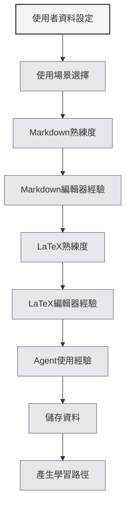

# 使用者資料

## 概述

使用者資料功能允許您設定個人資訊和使用偏好，幫助 MetaDoc 更好地理解您的需求，提供個人化的使用體驗和學習路徑。

## 使用者資料設定

### 開啟使用者資料

可以透過以下方式開啟使用者資料對話框：

- **主頁提示**：首次使用時，主頁可能會提示設定使用者資料
- **使用者手冊**：在使用者手冊中可以存取使用者資料設定
- **選單選項**：某些選單中可能有使用者資料選項

### 使用者資料介面

使用者資料介面包含以下主要部分：

<UserProfileView mode="demo" />

### 資料設定精靈

使用者資料設定採用分步精靈形式：

1. **使用場景**：選擇主要使用場景
2. **Markdown 熟練度**：評估 Markdown 語法熟悉程度
3. **Markdown 編輯器經驗**：選擇使用過的 Markdown 編輯器類型
4. **LaTeX 熟練度**：評估 LaTeX 語法熟悉程度
5. **LaTeX 編輯器經驗**：選擇使用過的 LaTeX 編輯器類型
6. **Agent 使用經驗**：評估 Agent 框架使用經驗

## 使用場景選擇

### 場景類型

可以選擇以下使用場景：

- **學生**：適合學生使用者，重點學習基礎編輯和 Markdown 功能
- **研究者**：適合研究者，重點學習 LaTeX 和學術寫作功能
- **IT 從業者**：適合 IT 從業者，重點學習 Agent 框架和高階功能
- **辦公使用者**：適合辦公使用者，重點學習基礎功能和匯出
- **其他**：其他使用場景

### 場景影響

選擇的場景會影響：

- **學習路徑**：系統會推薦相應的學習路徑
- **功能推薦**：優先推薦相關功能
- **AI 理解**：幫助 AI 更好地理解您的需求

## 技能評估

### Markdown 熟練度

評估您對 Markdown 語法的熟悉程度：

- **無經驗**：從未使用過 Markdown
- **基礎**：瞭解基本語法（標題、清單、連結等）
- **中級**：熟悉常用語法和擴充功能
- **高階**：精通 Markdown，瞭解各種擴充語法

### LaTeX 熟練度

評估您對 LaTeX 語法的熟悉程度：

- **無經驗**：從未使用過 LaTeX
- **基礎**：瞭解基本語法和文件結構
- **中級**：熟悉常用環境和命令
- **高階**：精通 LaTeX，能夠編寫複雜文件

<MenuItemsDemo mode="demo" :items='[{"id": "file"}]' />

### Agent 使用經驗

評估您對 Agent 框架的使用經驗：

- **無經驗**：從未使用過 Agent 功能
- **基礎**：瞭解基本概念，使用過簡單功能
- **中級**：熟悉工具集和工作流程
- **高階**：能夠建立複雜的 Agent 設定和工作流程

<AgentView mode="demo" />

## 編輯器經驗

### Markdown 編輯器經驗

選擇您使用過的 Markdown 編輯器類型：

- **WYSIWYG 編輯器**：使用過所見即所得編輯器
- **其他 Markdown 編輯器**：使用過其他 Markdown 編輯器

### LaTeX 編輯器經驗

選擇您使用過的 LaTeX 編輯器類型：

- **線上 LaTeX 編輯器**：使用過線上 LaTeX 編輯器
- **本機 LaTeX 編輯器**：使用過本機 LaTeX 編輯器

## 使用偏好設定

### 編輯偏好

可以設定編輯相關的偏好：

- **編輯模式**：偏好使用的編輯模式
- **預覽方式**：偏好使用的預覽方式
- **自動儲存**：自動儲存偏好

<MainTabs mode="demo" />

### 功能偏好

可以設定功能相關的偏好：

- **常用功能**：標記常用的功能
- **功能優先順序**：設定功能的優先順序
- **介面佈局**：偏好使用的介面佈局

<ViewMenuItemsDemo mode="demo" :items='["settings"]' />

## 使用者畫像設定

### 畫像產生

基於您的設定，系統會產生使用者畫像：

- **技能水平**：評估各項技能水平
- **使用場景**：識別主要使用場景
- **學習需求**：分析學習需求

### 畫像應用

使用者畫像會應用於：

- **學習路徑**：推薦個人化的學習路徑
- **功能推薦**：優先推薦相關功能
- **AI 輔助**：幫助 AI 更好地理解需求

## 學習路徑推薦

### 路徑類型

根據使用者資料，系統會推薦相應的學習路徑：

- **學生路徑**：適合學生使用者的學習路徑
- **研究者路徑**：適合研究者的學習路徑
- **IT 從業者路徑**：適合 IT 從業者的學習路徑
- **辦公使用者路徑**：適合辦公使用者的學習路徑

<AIChat mode="demo" />

### 路徑內容

學習路徑包含：

- **文件清單**：按順序排列的學習文件
- **學習目標**：每個文件的學習目標
- **預計時間**：完成學習預計需要的時間

## 資料更新

### 修改資料

可以隨時修改使用者資料：

1. 開啟使用者資料對話框
2. 修改各項設定
3. 儲存變更

### 資料同步

使用者資料會：

- **本機儲存**：儲存在本機
- **多視窗同步**：在所有視窗間同步
- **持久化**：下次啟動時仍然有效

## 最佳實踐

1. **如實填寫**：如實填寫各項資訊，獲得更準確的推薦
2. **定期更新**：隨著技能提升，定期更新資料
3. **場景選擇**：選擇最符合實際使用情況的場景
4. **技能評估**：客觀評估自己的技能水平
5. **利用推薦**：充分利用系統推薦的學習路徑

## 注意事項

1. **資料隱私**：使用者資料僅儲存在本機，不會上傳
2. **資料可選**：使用者資料設定是可選的，可以不設定
3. **推薦參考**：學習路徑推薦僅供參考，可以根據需要調整
4. **技能變化**：技能水平會變化，建議定期更新
5. **多場景**：如果使用多個場景，可以選擇最主要的場景

## 相關文件

- [[home.features|主頁功能]]
- [[user.feedback|使用者回饋]]
- [[quick-start.guide|快速開始指南]]

<MenuItemsDemo mode="demo" :items='[{"id": "settings"}]' />

<MainTabs mode="demo" />
