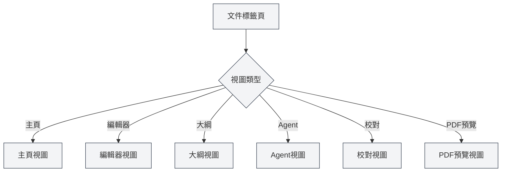

# 視圖類型

## 概述

MetaDoc支援多種視圖類型，每種視圖提供不同的功能和介面。您可以根據需要切換不同的視圖來完成各種任務。

## 視圖類型介紹

### 主頁視圖

主頁視圖是MetaDoc的入口介面，提供快速開始和最近文件功能。

<QuickStartPanel mode="demo" />

**主要功能**：

- **快速開始**：選擇文件格式，快速建立新文件
- **最近文件**：顯示最近開啟的文件列表
- **使用者手冊**：快速存取使用者手冊
- **使用者資料**：存取使用者資料設定

**使用場景**：

- 啟動應用後的初始介面
- 需要快速建立新文件
- 檢視最近使用的文件

您可以透過側邊欄切換不同的視圖。

### 編輯器視圖

編輯器視圖是文件編輯的主要介面，支援Markdown、LaTeX和純文字編輯。

<LaTeXEditor mode="demo" />

**主要功能**：

- **Markdown編輯**：使用Vditor編輯器編輯Markdown文件
- **LaTeX編輯**：使用Monaco編輯器編輯LaTeX文件
- **純文字編輯**：使用Monaco編輯器編輯純文字
- **即時預覽**：Markdown編輯器支援即時預覽

**使用場景**：

- 編輯文件內容
- 編寫技術文件
- 創作學術論文

### 大綱視圖

大綱視圖顯示文件的結構化大綱，方便檢視和編輯文件結構。

<Outline mode="demo" />

**主要功能**：

- **大綱顯示**：以樹狀結構顯示文件標題
- **節點操作**：新增、編輯、刪除、移動節點
- **拖曳排序**：拖曳節點調整順序
- **AI功能**：生成子章節、生成內容、大綱優化

**使用場景**：

- 檢視文件結構
- 快速導航到特定章節
- 編輯文件大綱
- 使用AI生成內容

### Agent視圖

Agent視圖提供Agent框架的互動介面，用於建立和管理Agent會話。

<AgentView mode="demo" />

**主要功能**：

- **會話管理**：建立、編輯、刪除Agent會話
- **工具配置**：配置Agent使用的工具集
- **工作流程**：建立和執行工作流程
- **訊息互動**：與Agent進行對話

**使用場景**：

- 使用Agent完成複雜任務
- 自動化文件處理
- 批次操作文件

### 校對視圖

校對視圖提供AI校對功能，檢查文件中的錯誤並提供修改建議。

<ProofreadView mode="demo" />

**主要功能**：

- **錯誤偵測**：偵測拼寫、語法、LaTeX語法錯誤
- **錯誤列表**：顯示所有偵測到的錯誤
- **錯誤修復**：單一修復或一鍵修復全部
- **詞典管理**：新增單字到詞典

**使用場景**：

- 檢查文件錯誤
- 提高文件品質
- 修正拼寫和語法錯誤

### PDF預覽視圖

PDF預覽視圖顯示LaTeX文件編譯後的PDF預覽（僅LaTeX文件）。

<PdfPreviewPanel mode="demo" pdfUrl="" />

**主要功能**：

- **PDF顯示**：顯示編譯後的PDF內容
- **縮放控制**：放大、縮小PDF
- **重新整理PDF**：重新編譯並重新整理PDF
- **定位到程式碼**：從PDF位置定位到LaTeX程式碼

**使用場景**：

- 預覽LaTeX文件效果
- 檢查PDF格式
- 定位PDF中的問題

## 視圖切換

### 切換方式

可以透過以下方式切換視圖：

<MainTabs mode="demo" />

<ViewMenuItemsDemo mode="demo" :items='["editor", "outline", "agent"]' />

1. **視圖選單**：點選左側的視圖選單按鈕
2. **視圖選擇器**：在視圖選單中選擇要切換的視圖
3. **快速鍵**：某些視圖可能有快速鍵（未來可能支援）

### 視圖選單

視圖選單顯示在左側邊欄：

- **主頁**：切換到主頁視圖
- **編輯器**：切換到編輯器視圖
- **大綱**：切換到大綱視圖
- **Agent**：切換到Agent視圖
- **校對**：切換到校對視圖
- **PDF預覽**：切換到PDF預覽視圖（僅LaTeX文件）

### 視圖狀態

每個文件標籤頁都有獨立的視圖狀態：

- **視圖記憶**：切換視圖後，視圖狀態會儲存
- **下次開啟**：下次開啟文件時會恢復到上次的視圖
- **多標籤頁**：不同標籤頁可以使用不同的視圖

## 視圖特性

### 視圖獨立性

每個視圖都是獨立的：

- **狀態獨立**：每個視圖有獨立的狀態
- **資料同步**：視圖間資料自動同步
- **切換快速**：視圖切換非常快速，無需重新載入

### 視圖組合

某些視圖可以組合使用：

- **編輯器+大綱**：同時檢視編輯器和大綱
- **編輯器+PDF預覽**：LaTeX編輯器可以同時顯示程式碼和PDF
- **編輯器+校對**：可以在編輯時進行校對

## 視圖使用建議

### 編輯文件

- **編輯器視圖**：主要使用編輯器視圖進行編輯
- **大綱視圖**：需要檢視結構時切換到大綱視圖
- **PDF預覽**：LaTeX文件編輯時使用PDF預覽檢視效果

### 文件校對

- **校對視圖**：專門用於文件校對
- **編輯器視圖**：校對後回到編輯器視圖繼續編輯

### Agent任務

- **Agent視圖**：建立和管理Agent會話
- **編輯器視圖**：檢視Agent處理後的文件

## 注意事項

1. **視圖切換**：視圖切換會儲存目前狀態
2. **PDF預覽**：僅LaTeX文件支援PDF預覽視圖
3. **視圖狀態**：每個標籤頁的視圖狀態獨立儲存
4. **資料同步**：視圖間資料會自動同步
5. **效能考量**：某些視圖可能佔用較多資源

## 相關文件

- [[core.multi-tab|多標籤頁管理]]
- [[outline.basics|大綱視圖功能]]
- [[agent.session|Agent會話管理]]
- [[ai.proofread|AI校對功能]]
- [[latex.pdf-preview|PDF預覽功能]]